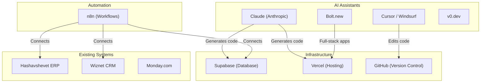

# Lab 001 – The AI Landscape & Setting Up Your Tools

!!! hint "Overview"

    - In this lab, you will understand what AI / LLMs are and how they can help Elcon build internal business systems.
    - You will survey the tool ecosystem: Claude, n8n, Cursor, Bolt.new, Supabase, and more.
    - You will set up accounts on all the platforms you'll use throughout this course.
    - By the end of this lab, you will have a working environment and a clear mental map of what each tool does.

## Prerequisites

- Laptop with Chrome or Edge browser
- Google account for sign-ups
- Internet connection

## What You Will Learn

- What is an LLM (Large Language Model) and how does it work – demystified
- Prompts, context windows, tokens – the vocabulary you need
- The difference between chat-based AI, code-generation AI, and automation platforms
- When to use AI vs. traditional software
- Elcon's current system map and pain points

---

## Background

### Where Elcon Stands Today

Elcon currently uses several disconnected systems:

| System       | Purpose                    | Limitation                           |
| ------------ | -------------------------- | ------------------------------------ |
| Hashavshevet | ERP (accounting, invoices) | Outdated, hard to extend             |
| Wiznet CRM   | Customer management        | Standalone, no integration           |
| Monday.com   | Task management            | Expensive for what we use            |
| Smadar       | Delivery note scanning     | Limited, single-purpose              |
| Excel        | Everything else            | Manual, error-prone, no automation   |
| File Server  | Drawing management         | Folder-based, no search, no metadata |

### What AI Can Do For Us

AI tools can help bridge the gaps between these systems by:

- **Building custom apps** in hours instead of months (e.g., the Import Management System)
- **Automating workflows** between systems (n8n)
- **Creating dashboards** on top of existing data (ERP, CRM)
- **Processing documents** automatically (OCR, data extraction)

### The Tool Ecosystem



---

## Lab Steps

### Step 1 – Understand the Key Concepts

Read through the following definitions. These terms will come up throughout the course:

| Term               | Definition                                                                               |
| ------------------ | ---------------------------------------------------------------------------------------- |
| **LLM**            | Large Language Model – an AI trained on text that can generate code, text, and reasoning |
| **Prompt**         | The text you send to an AI to get a response                                             |
| **Context Window** | The maximum amount of text an AI can "see" at once (e.g., 200K tokens for Claude)        |
| **Token**          | A chunk of text (~4 characters). AI models read and generate in tokens                   |
| **Artifact**       | A self-contained output from Claude (code, document, diagram) you can preview and edit   |
| **Workflow**       | An automated sequence of steps in n8n that connects triggers to actions                  |
| **API**            | Application Programming Interface – how software systems talk to each other              |

### Step 2 – Set Up Your Accounts

Create accounts on each of the following platforms:

!!! note "Account Checklist"

    - [ ] **Claude** – Go to [claude.ai](https://claude.ai) and sign up. Upgrade to Pro if possible.
    - [ ] **GitHub** – Go to [github.com](https://github.com) and create an account.
    - [ ] **Supabase** – Go to [supabase.com](https://supabase.com) and sign up with GitHub.
    - [ ] **Vercel** – Go to [vercel.com](https://vercel.com) and sign up with GitHub.
    - [ ] **n8n Cloud** – Go to [n8n.io](https://n8n.io) and sign up for the free trial.
    - [ ] **Cursor** – Go to [cursor.com](https://cursor.com) and download the editor.

### Step 3 – Your First AI Interaction

1. Open Claude at [claude.ai](https://claude.ai)
2. Type the following prompt:

   ```
   I work at a company called Elcon that manufactures instrumentation and control equipment.
   We have 200 suppliers and manage all purchase orders in Excel spreadsheets.

   What kind of web application would you build to replace this Excel-based process?
   Give me a high-level description with the main features.
   ```

3. Read Claude's response carefully
4. Ask a follow-up question to refine the answer

!!! success "What to Notice"

    - Claude understands business context, not just code
    - The more specific your description, the better the output
    - You can iterate and refine through conversation

### Step 4 – Compare Tools

Try the same prompt in different tools and compare the results:

1. **Claude** (claude.ai) – Full conversation, detailed reasoning
2. **Bolt.new** (bolt.new) – Generates a full working app immediately
3. **v0.dev** (v0.dev) – Generates a UI component

!!! question "Discussion"

    - Which tool gave the most useful output for your use case?
    - When would you use each tool?
    - What are the limitations you noticed?

---

## Summary

In this lab you:

- [x] Understood what LLMs are and how they can help Elcon
- [x] Mapped Elcon's current systems and identified pain points
- [x] Set up accounts on Claude, GitHub, Supabase, Vercel, n8n, and Cursor
- [x] Had your first AI conversation about a real business problem
- [x] Compared different AI tools and their strengths
