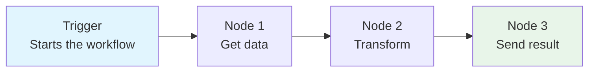
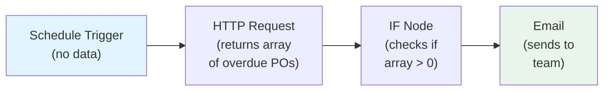
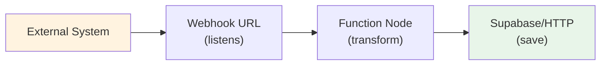
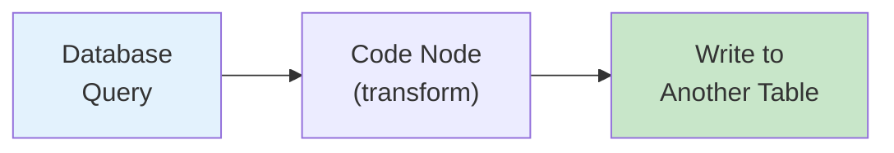
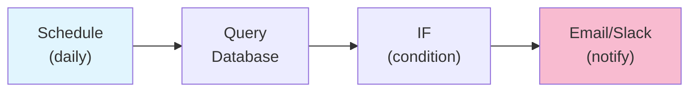
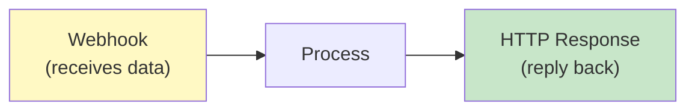

# Lab 007 - n8n Basics: Visual Workflow Automation

!!! hint "Overview"

    - In this lab, you will learn the fundamentals of n8n - a visual workflow automation platform.
    - You will understand nodes, triggers, connections, and how data flows through a workflow.
    - You will build your first automated workflow from scratch.
    - By the end of this lab, you will understand how n8n can serve as the "glue" between all of Elcon's systems.

## Prerequisites

- n8n Cloud account or self-hosted n8n instance
- Supabase project from Lab 004

## What You Will Learn

- What n8n is and why it's the best choice for Elcon
- Core concepts: nodes, triggers, connections, workflows
- HTTP requests, webhooks, and cron schedules
- Data mapping and transformation
- Building your first workflow

---

## Background

## Why n8n?

| Feature              | n8n                        | Zapier            | Make (Integromat) |
| -------------------- | -------------------------- | ----------------- | ----------------- |
| Self-hosted          | ✅ Yes (free)              | ❌ No             | ❌ No             |
| Data stays on server | ✅ Yes                     | ❌ No             | ❌ No             |
| Workflows            | ♾️ Unlimited (self-hosted) | Limited by plan   | Limited by plan   |
| Database connections | ✅ Direct SQL              | ❌ Via connectors | ⚠️ Limited        |
| AI nodes             | ✅ Claude, OpenAI, etc.    | ⚠️ Limited        | ⚠️ Limited        |
| Code nodes           | ✅ JavaScript & Python     | ❌ No             | ⚠️ Limited        |
| Price                | Free (self-hosted)         | $20-600/mo        | $10-300/mo        |

## Core Concepts



| Concept        | What It Is                                                          |
| -------------- | ------------------------------------------------------------------- |
| **Trigger**    | What starts the workflow (schedule, webhook, new data, manual)      |
| **Node**       | A single step that does something (get data, transform, send email) |
| **Connection** | The wire between nodes that carries data                            |
| **Workflow**   | The complete chain of trigger + nodes                               |
| **Execution**  | One complete run of a workflow                                      |
| **Credential** | Saved login info for connecting to external services                |

---

## Lab Steps

## Step 1 - Access n8n

**Option A - n8n Cloud (recommended for this lab):**

- Go to [n8n.io](https://n8n.io) and sign in
- You'll land on the workflow editor

**Option B - Self-hosted (for production):**

```bash
# Docker one-liner to run n8n locally
docker run -it --rm \
  --name n8n \
  -p 5678:5678 \
  -v ~/.n8n:/home/node/.n8n \
  n8nio/n8n
```

Access at `http://localhost:5678`

## Step 2 - Your First Workflow: Scheduled Data Check

Build a workflow that checks for overdue purchase orders every morning:

1. **Add a Schedule Trigger** - Click the `+` button and search for "Schedule"
   - Set to run every day at 8:00 AM
2. **Add a Supabase Node** - Search for "Supabase" or use "HTTP Request"
   - Method: GET
   - URL: `https://YOUR_PROJECT.supabase.co/rest/v1/purchase_orders`
   - Headers:
     - `apikey`: your anon key
     - `Authorization`: `Bearer your_anon_key`
   - Query: `?status=neq.Received&status=neq.Cancelled&expected_delivery=lt.2026-04-17`
3. **Add an IF Node** - Check if there are any results
   - Condition: `{{ $json.length > 0 }}`
4. **Add an Email Node** - Send notification if overdue orders exist
   - To: procurement@elcon.co.il
   - Subject: `⚠️ {{ $json.length }} Overdue Purchase Orders`
   - Body: List the overdue POs
5. **Test the workflow** - Click "Execute Workflow"

## Step 3 - Understanding Data Flow

In n8n, each node receives data from the previous node and passes data to the next:



!!! tip "Debugging Data Flow"

    Click on any node after execution to see:
    - **Input**: what data came in
    - **Output**: what data goes out
    - **Settings**: the node configuration

    This is the most powerful debugging tool in n8n.

## Step 4 - Webhook Workflow

Build a workflow that receives data from external systems via webhook:

1. **Webhook Trigger** - Creates a URL that listens for incoming requests
2. **Function Node** - Transform the incoming data
3. **Supabase/HTTP Node** - Save to database



This pattern is useful for:

- Receiving data from Smadar (delivery note scans)
- Accepting form submissions
- Integrating with any system that can send HTTP requests

## Step 5 - Common n8n Patterns

#### Pattern: Read → Transform → Write



#### Pattern: Schedule → Check → Notify



#### Pattern: Webhook → Process → Respond



---

## Hands-On Exercise

Build **two workflows** from scratch:

1. **Daily Supplier Report**: Query all suppliers from Supabase → Generate an HTML table → Send as email
2. **New Order Webhook**: Create a webhook that accepts PO data → Validates it → Saves to Supabase → Returns confirmation

---

## Summary

In this lab you:

- [x] Understood why n8n is the best workflow automation tool for Elcon
- [x] Learned core concepts: triggers, nodes, connections, workflows
- [x] Built a scheduled workflow that checks for overdue orders
- [x] Built a webhook workflow that accepts external data
- [x] Practiced data flow debugging
- [x] Explored common n8n patterns
