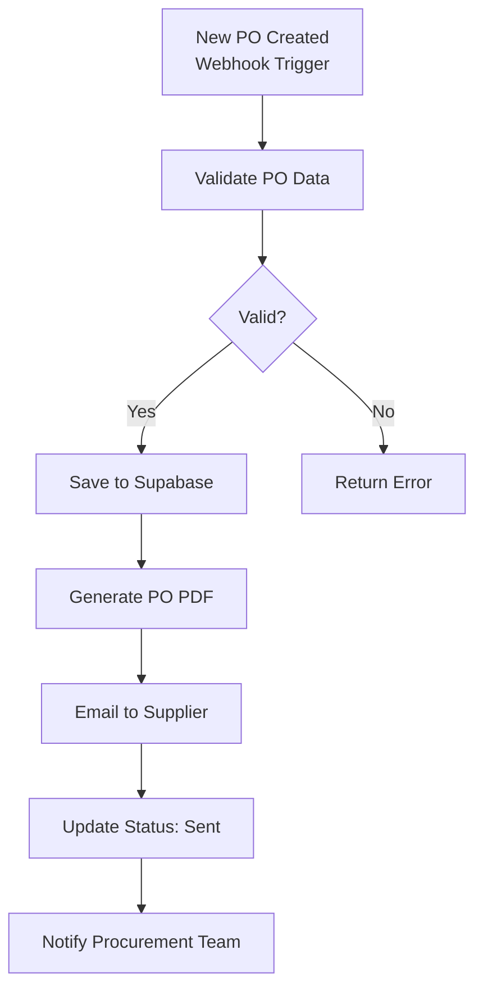
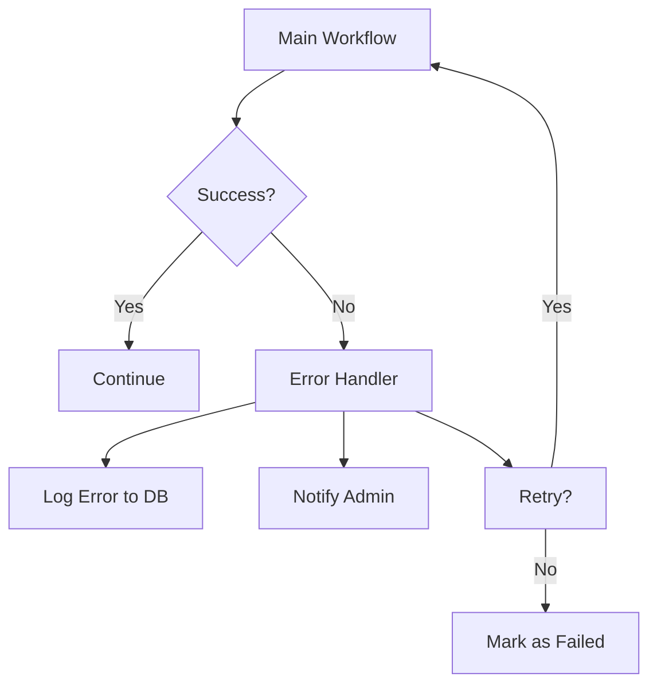

# Lab 008 - n8n Advanced: Real Elcon Workflows

!!! hint "Overview"

    - In this lab, you will build production-ready n8n workflows for real Elcon use cases.
    - You will automate import management, CRM sync, and task management workflows.
    - You will learn error handling, retry logic, and workflow best practices.
    - By the end of this lab, you will have working automations that can replace manual processes.

## Prerequisites

- Completed Lab 007 (n8n Basics)
- Supabase project with tables from Lab 004
- n8n Cloud or self-hosted instance

## What You Will Learn

- Building complex multi-step workflows
- Error handling and retry strategies
- Replacing Monday.com with n8n + Supabase
- CRM sync patterns
- ERP data synchronization

---

## Lab Steps

## Step 1 - Import Management Automation

Build an end-to-end workflow for purchase order management:



**Build this step by step:**

1. **Webhook Trigger** - Receives PO data from your app
2. **Code Node (Validate)** - Check required fields, validate amounts
3. **IF Node** - Route valid/invalid POs
4. **Supabase Node** - Save the PO
5. **HTML Node** - Generate a PO document
6. **Email Node** - Send to supplier with PDF attachment
7. **Supabase Node** - Update PO status to "Sent"
8. **Email/Slack Node** - Notify the team

## Step 2 - Monday.com Replacement: Task Management

Replace Monday.com with n8n + Supabase for task management:

**Create the task table in Supabase:**

```sql
CREATE TABLE tasks (
    id          UUID DEFAULT gen_random_uuid() PRIMARY KEY,
    created_at  TIMESTAMPTZ DEFAULT now(),
    title       TEXT NOT NULL,
    description TEXT,
    assigned_to TEXT,
    status      TEXT DEFAULT 'To Do'
                CHECK (status IN ('To Do','In Progress','Review','Done')),
    priority    TEXT DEFAULT 'Medium'
                CHECK (priority IN ('Low','Medium','High','Urgent')),
    due_date    DATE,
    project     TEXT,
    updated_at  TIMESTAMPTZ DEFAULT now()
);
```

**Build workflows for:**

1. **New Task Notification** - When a task is created → email the assigned person
2. **Overdue Task Alert** - Daily check → email list of overdue tasks to managers
3. **Weekly Status Report** - Every Friday → generate summary → email team

## Step 3 - CRM Sync: Wiznet ↔ Your Dashboards

Build a sync workflow between Wiznet CRM and your Supabase database:

```
Schedule (hourly) → Query Wiznet API → Compare with Supabase → Update changes → Log sync
```

**Implementation:**

1. **Schedule Trigger** - Run every hour
2. **HTTP Request** - Query Wiznet CRM API (or database)
3. **Code Node** - Compare CRM data with Supabase data, identify changes
4. **Supabase Node** - Upsert changed records
5. **Code Node** - Generate sync log
6. **Supabase Node** - Save sync log for audit

## Step 4 - Error Handling

Every production workflow needs error handling:



**Key error handling patterns in n8n:**

- **Error Trigger** - A special workflow that runs when any workflow fails
- **Try/Catch** - Use the "On Error" option on each node: Continue / Stop / Retry
- **Retry** - Configure retry count and delay on nodes that might fail (e.g., API calls)
- **Dead Letter Queue** - Save failed items to a database table for manual review

## Step 5 - Smadar Integration: Delivery Note Processing

Build a workflow that processes delivery note scans:

```
Webhook (receives image) → OCR extraction → Match to PO → Update PO status → Notify team
```

!!! info "OCR Options"

    - Use Claude's vision capability via API to read the delivery note image
    - Or use a dedicated OCR service (Google Vision, AWS Textract)
    - n8n has nodes for both approaches

---

## Hands-On Workshop

Build **at least 2** of these workflows:

1. ✅ Import Management automation (Step 1)
2. ✅ Task management replacement for Monday.com (Step 2)
3. CRM sync with Wiznet (Step 3)
4. Delivery note processor (Step 5)

---

## Summary

In this lab you:

- [x] Built a complete import management automation workflow
- [x] Created a task management system to replace Monday.com
- [x] Learned CRM synchronization patterns
- [x] Implemented error handling and retry logic
- [x] Explored delivery note processing with OCR
