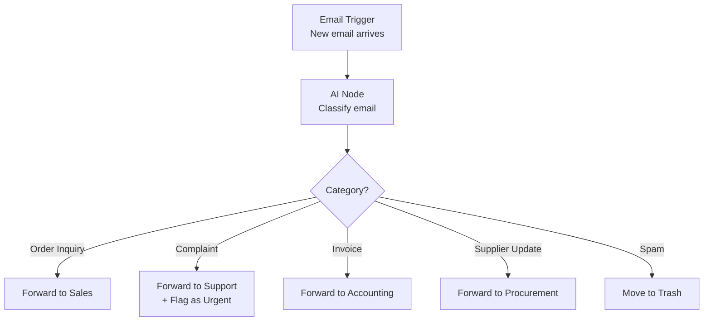
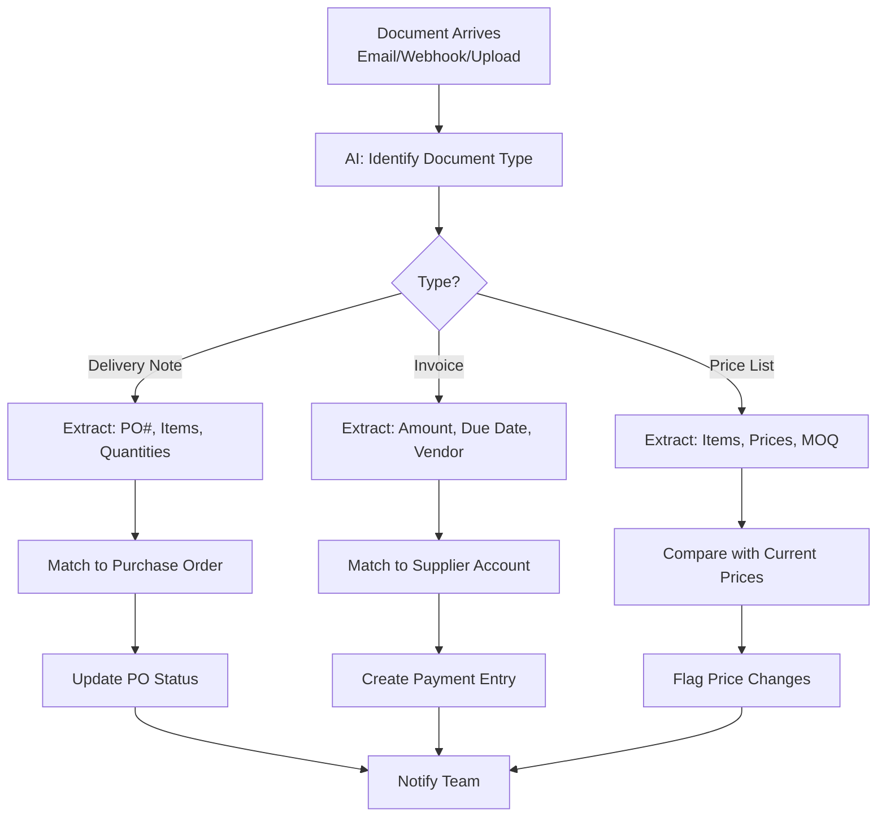

# Lab 009 - n8n + AI: Intelligent Automation

!!! hint "Overview"

    - In this lab, you will add AI capabilities to your n8n workflows using Claude and OpenAI nodes.
    - You will build workflows that classify, extract, and generate content automatically.
    - You will create an AI-powered document processing pipeline.
    - By the end of this lab, you will understand how to combine automation with AI for powerful business solutions.

## Prerequisites

- Completed Labs 007-008 (n8n Basics & Advanced)
- Claude API key or OpenAI API key
- n8n instance with AI nodes available

## What You Will Learn

- Using Claude/OpenAI nodes inside n8n workflows
- AI-powered email classification and routing
- Document data extraction with AI
- Generating reports and summaries with AI
- Best practices for AI in automation

---

## Background

## AI + Automation = Superpowers

| Traditional Automation             | AI-Powered Automation                   |
| ---------------------------------- | --------------------------------------- |
| Moves data between systems         | Understands and interprets data         |
| Follows exact rules                | Handles ambiguous inputs                |
| Can only process structured data   | Can read PDFs, images, free-text emails |
| Rules must be coded for every case | AI generalizes from examples            |

---

## Lab Steps

## Step 1 - Set Up AI Credentials in n8n

1. In n8n, go to **Credentials** → **Add Credential**
2. Search for "Anthropic" (Claude) or "OpenAI"
3. Enter your API key
4. Test the connection

## Step 2 - Email Classification and Routing

Build a workflow that automatically classifies incoming emails:



**AI Classification Prompt:**

```
Classify this email into one of these categories:
- ORDER_INQUIRY: Customer asking about ordering products
- COMPLAINT: Customer complaint or issue
- INVOICE: Invoice, payment, or billing related
- SUPPLIER_UPDATE: Supplier communication about deliveries or prices
- SPAM: Irrelevant or spam
- OTHER: Doesn't fit above categories

Also extract:
- urgency: LOW, MEDIUM, HIGH
- customer_name: if mentioned
- order_number: if mentioned

Email subject: {{ $json.subject }}
Email body: {{ $json.body }}

Respond in JSON format only.
```

## Step 3 - Supplier Price List Extraction

Build a workflow that extracts data from supplier price list PDFs:

```
Receive PDF → AI extracts structured data → Compare with existing prices → Flag changes → Update database
```

**Implementation:**

1. **Webhook** - Receives the PDF file
2. **AI Node (Claude)** - Send the PDF content with this prompt:

   ```
   Extract all items from this supplier price list.
   For each item, provide:
   - part_number
   - description
   - unit_price
   - currency
   - minimum_order_quantity (if specified)
   - lead_time (if specified)

   Return as a JSON array.
   ```

3. **Code Node** - Compare extracted prices with existing database prices
4. **IF Node** - Check if any prices changed
5. **Supabase Node** - Update changed prices
6. **Email Node** - Notify procurement of price changes

## Step 4 - AI-Generated Weekly Reports

Build a workflow that generates management reports using AI:

```
Schedule (Friday 4 PM) → Query all week's data → AI generates summary → Email report
```

**AI Report Prompt:**

```
You are a business analyst at Elcon, an instrumentation and control company.

Based on this week's data, write a concise management report:

Purchase Orders This Week:
{{ $json.orders }}

Deliveries Received:
{{ $json.deliveries }}

Overdue Orders:
{{ $json.overdue }}

New Customers:
{{ $json.new_customers }}

Format the report with:
1. Executive Summary (3 sentences)
2. Key Metrics (table)
3. Issues Requiring Attention (bullet points)
4. Upcoming Deliveries Next Week
5. Recommendations

Use professional, concise language.
```

## Step 5 - Intelligent Document Processing Pipeline

Combine everything into a complete document processing system:



---

## Best Practices for AI in Automation

!!! warning "Important Guidelines"

    1. **Always validate AI outputs** - AI can hallucinate. Add validation nodes after AI processing.
    2. **Use structured output formats** - Ask for JSON, not free text, when you need to process the result.
    3. **Set temperature to 0** - For data extraction tasks, use temperature=0 for consistent results.
    4. **Handle failures gracefully** - AI calls can fail. Always add error handling.
    5. **Monitor costs** - Each AI API call costs money. Monitor your usage.
    6. **Keep prompts in a central place** - Store prompts in a database or file so they're easy to update.

---

## Summary

In this lab you:

- [x] Set up AI credentials in n8n (Claude/OpenAI)
- [x] Built an email classification and routing workflow
- [x] Created a supplier price list extraction pipeline
- [x] Generated AI-powered management reports
- [x] Designed a complete intelligent document processing system
- [x] Learned best practices for AI in automation
