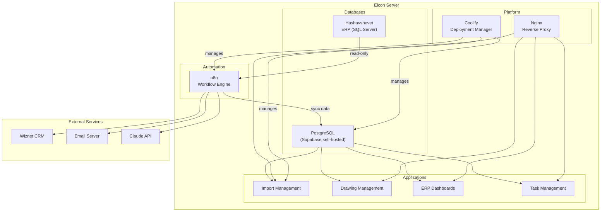

# Lab 011 – System Architecture: Designing Elcon's Stack

!!! hint "Overview"

    - In this lab, you will design the target architecture for all of Elcon's internal systems.
    - You will understand how all the tools and platforms fit together.
    - You will plan the deployment on Elcon's server using Docker and Coolify.
    - By the end of this lab, you will have a clear blueprint for Elcon's technology infrastructure.

## Prerequisites

- Understanding of all tools from previous labs
- Basic understanding of servers and networks

## What You Will Learn

- How to design a complete system architecture
- Docker basics: what containers are and why they matter
- Self-hosting with Coolify
- How all Elcon systems connect together
- Planning for growth and scalability

---

## Background

### The Target Architecture



---

## Lab Steps

### Step 1 – Understanding Docker (Conceptual)

Docker puts each application in its own "container" – an isolated, portable package:

| Concept       | Analogy                                  | What It Means                          |
| ------------- | ---------------------------------------- | -------------------------------------- |
| **Image**     | A recipe                                 | The blueprint for your application     |
| **Container** | A dish made from the recipe              | A running instance of your application |
| **Volume**    | A storage shelf                          | Persistent data that survives restarts |
| **Network**   | A table where dishes are served together | How containers talk to each other      |
| **Compose**   | A full menu with all dishes              | A file defining all your containers    |

**Why Docker for Elcon?**

- Each app runs in isolation (one crashing doesn't affect others)
- Easy to deploy, update, and rollback
- Consistent environment (works the same everywhere)
- All tools (n8n, Supabase, apps) can run as containers

### Step 2 – Docker Compose for Elcon's Stack

Here's what Elcon's complete stack looks like as Docker Compose:

```yaml
# docker-compose.yml - Elcon Internal Systems
version: "3.8"

services:
  # PostgreSQL Database
  postgres:
    image: postgres:16
    restart: always
    volumes:
      - postgres_data:/var/lib/postgresql/data
    environment:
      POSTGRES_PASSWORD: ${DB_PASSWORD}
      POSTGRES_DB: elcon
    ports:
      - "5432:5432"

  # n8n Workflow Automation
  n8n:
    image: n8nio/n8n
    restart: always
    volumes:
      - n8n_data:/home/node/.n8n
    environment:
      - DB_TYPE=postgresdb
      - DB_POSTGRESDB_HOST=postgres
      - DB_POSTGRESDB_DATABASE=elcon
      - DB_POSTGRESDB_USER=postgres
      - DB_POSTGRESDB_PASSWORD=${DB_PASSWORD}
    ports:
      - "5678:5678"
    depends_on:
      - postgres

  # Import Management App
  import-management:
    image: nginx:alpine
    restart: always
    volumes:
      - ./apps/import-management:/usr/share/nginx/html:ro
    ports:
      - "8001:80"

  # Drawing Management App
  drawing-management:
    image: nginx:alpine
    restart: always
    volumes:
      - ./apps/drawing-management:/usr/share/nginx/html:ro
    ports:
      - "8002:80"

  # Nginx Reverse Proxy
  nginx:
    image: nginx:alpine
    restart: always
    volumes:
      - ./nginx/nginx.conf:/etc/nginx/nginx.conf:ro
    ports:
      - "80:80"
      - "443:443"
    depends_on:
      - import-management
      - drawing-management
      - n8n

volumes:
  postgres_data:
  n8n_data:
```

!!! info "Don't Worry About the Details"

    You don't need to write Docker Compose files by hand.
    Ask Claude to generate them, or use Coolify which handles this automatically.

### Step 3 – Self-Hosting with Coolify

[Coolify](https://coolify.io) is an open-source, self-hosted alternative to Vercel/Netlify/Heroku:

**What Coolify does:**

- Visual dashboard to deploy and manage applications
- Automatic SSL certificates (HTTPS)
- Built-in database management (PostgreSQL, MySQL, Redis)
- Git-based deployments (push to deploy)
- Monitoring and logs
- Backup management

**Installation (on your server):**

```bash
curl -fsSL https://cdn.coollabs.io/coolify/install.sh | bash
```

**After installation:**

1. Open `http://your-server-ip:8000`
2. Create your admin account
3. Add your server as a resource
4. Deploy services: PostgreSQL, n8n, your apps

### Step 4 – Network Architecture

```
                    INTERNET
                       │
                 ┌─────┴─────┐
                 │  Firewall  │
                 └─────┬─────┘
                       │
              ┌────────┴────────┐
              │  Elcon Server   │
              │  (Coolify)      │
              │                 │
              │  ┌───────────┐  │
              │  │   Nginx   │  │
              │  │ (port 443)│  │
              │  └─────┬─────┘  │
              │        │        │
              │  ┌─────┼─────┐  │
              │  │     │     │  │
              │  ▼     ▼     ▼  │
              │ Apps  n8n   DB  │
              │                 │
              │  ┌───────────┐  │
              │  │Hashavshevet│  │
              │  │   (ERP)   │  │
              │  └───────────┘  │
              └─────────────────┘
```

!!! tip "Start Simple, Grow Later"

    Phase 1: Deploy on Vercel (free, easy)
    Phase 2: Deploy n8n on your server
    Phase 3: Move everything to your server with Coolify
    Phase 4: Connect to Hashavshevet ERP

---

## Summary

In this lab you:

- [x] Designed Elcon's target system architecture
- [x] Understood Docker containers at a conceptual level
- [x] Saw a complete Docker Compose configuration for Elcon
- [x] Explored Coolify for self-hosted deployment
- [x] Planned the network architecture
- [x] Understood the phased rollout approach
