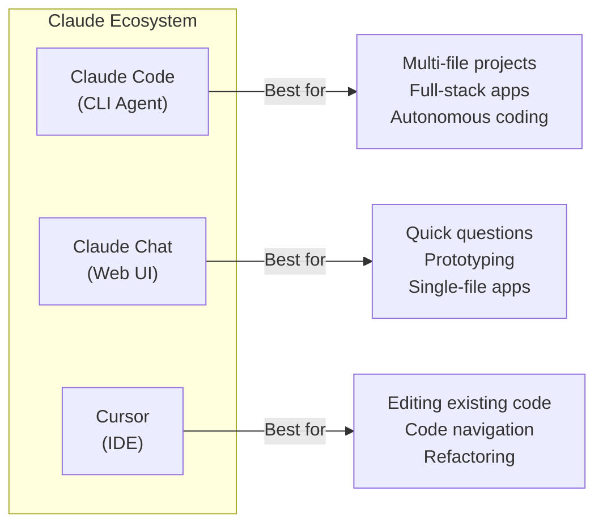
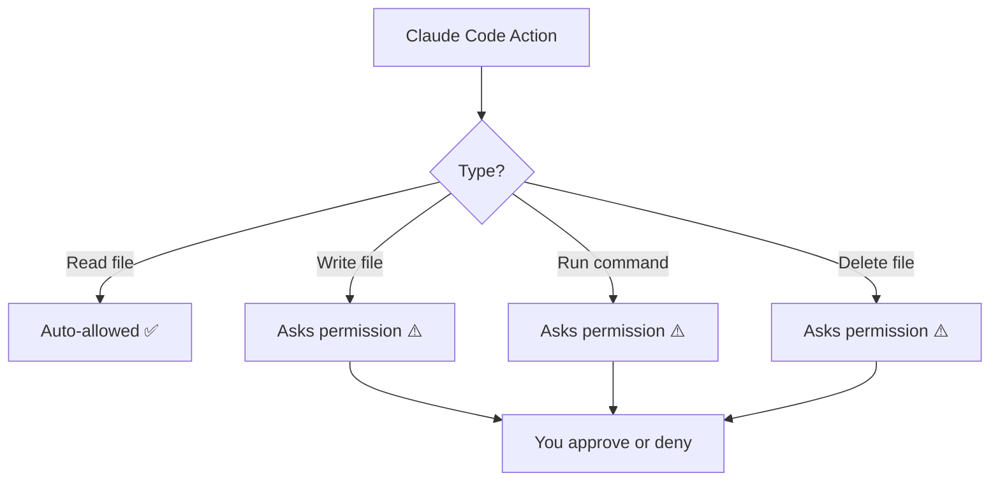

# Lab 020 – Introduction to Claude Code

!!! hint "Overview"

    - In this lab, you will install and configure Claude Code – Anthropic's CLI-based AI coding agent.
    - You will understand how Claude Code differs from Claude chat and when to use each.
    - You will run your first Claude Code commands in the terminal.
    - By the end of this lab, you will have a working Claude Code environment ready for building apps.

## Prerequisites

- Claude account (Pro or Team plan recommended)
- Terminal / command line basics
- Node.js 18+ installed

## What You Will Learn

- What Claude Code is and how it differs from Claude chat
- Installing and authenticating Claude Code
- The Claude Code CLI interface and key commands
- When to use Claude Code vs. Claude chat vs. Cursor

---

## Background

### Claude Code vs. Claude Chat vs. Cursor



| Feature            | Claude Chat        | Claude Code              | Cursor / Windsurf    |
| ------------------ | ------------------ | ------------------------ | -------------------- |
| Interface          | Web browser        | Terminal / CLI           | IDE (VS Code fork)   |
| File access        | Upload only        | Full filesystem access   | Open project folder  |
| Multi-file editing | One file at a time | Edits many files at once | Edits many files     |
| Runs commands      | No                 | Yes (with permission)    | Yes (terminal)       |
| Git integration    | No                 | Yes                      | Yes                  |
| Autonomous mode    | No                 | Yes                      | Partial              |
| Best for           | Quick prototypes   | Building full projects   | Maintaining projects |

---

## Lab Steps

### Step 1 – Install Claude Code

```bash
# Install via npm (requires Node.js 18+)
npm install -g @anthropic-ai/claude-code

# Verify installation
claude --version
```

### Step 2 – Authenticate

```bash
# Login with your Anthropic account
claude login

# This opens a browser window for authentication
# After auth, you'll see: ✓ Logged in successfully
```

### Step 3 – Your First Claude Code Session

```bash
# Create a project directory
mkdir ~/elcon-demo && cd ~/elcon-demo

# Start Claude Code
claude

# You're now in an interactive session
# Try these commands:
```

In the Claude Code session, type:

```
Create a simple HTML page that says "Hello Elcon!" with a blue header and centered text
```

!!! success "What Just Happened"

    Claude Code:
    1. Created a new file `index.html`
    2. Wrote the HTML, CSS, and content
    3. Showed you exactly what it did
    4. You can see the file in your directory

### Step 4 – Key Claude Code Commands

| Command                | What It Does                                   |
| ---------------------- | ---------------------------------------------- |
| `claude`               | Start interactive session in current directory |
| `claude "prompt here"` | Run a one-shot command                         |
| `claude --continue`    | Resume the last conversation                   |
| `claude --model`       | Choose a specific model                        |
| `/help`                | Show help inside a session                     |
| `/clear`               | Clear conversation history                     |
| `/cost`                | Show token usage and cost                      |
| `Ctrl+C`               | Cancel current operation                       |
| `exit` or `Ctrl+D`     | Exit the session                               |

### Step 5 – Understanding Permissions

Claude Code asks permission before:



!!! warning "Always Review Before Approving"

    Read what Claude Code wants to do before pressing Enter.
    For destructive operations (delete, overwrite), double-check.

---

## Tasks

!!! note "Task 1"
Install Claude Code and authenticate. Run `claude --version` to verify.

!!! note "Task 2"
Start a Claude Code session and ask it to create a "Hello World" web page. Check the generated file.

!!! note "Task 3"
Use one-shot mode: `claude "List all files in this directory and explain what each one does"`

---

## Summary

In this lab you:

- [x] Installed and authenticated Claude Code
- [x] Understood the difference between Claude Code, Claude Chat, and Cursor
- [x] Ran your first interactive and one-shot sessions
- [x] Learned key commands and the permission model
