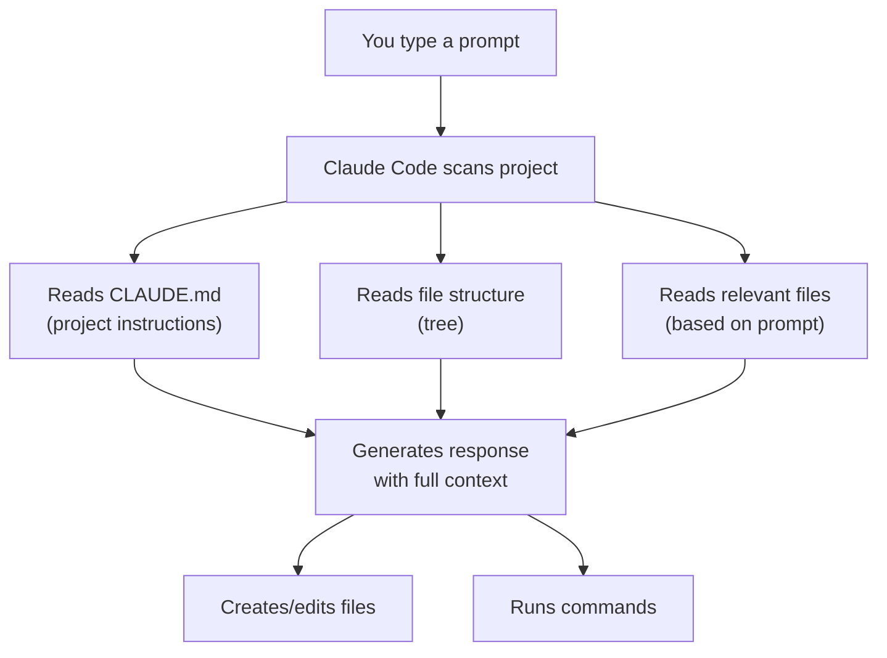
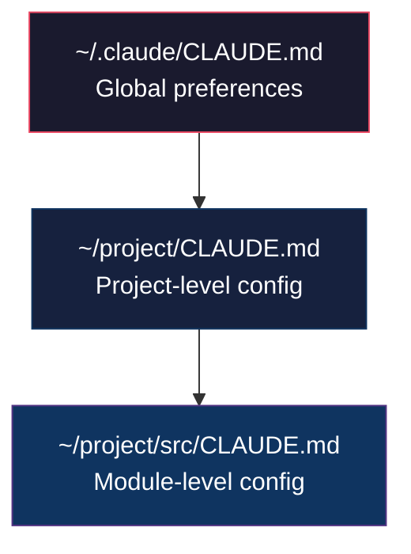

# Lab 021 – Claude Code: Project Setup & Configuration

!!! hint "Overview"

    - In this lab, you will learn how to configure Claude Code for a project using `CLAUDE.md` files.
    - You will set up project-specific instructions that persist across sessions.
    - You will understand memory, context, and how Claude Code reads your codebase.
    - By the end of this lab, your projects will have proper Claude Code configuration for consistent results.

## Prerequisites

- Claude Code installed (Lab 020)
- A project folder with some files

## What You Will Learn

- The `CLAUDE.md` file and project instructions
- How Claude Code reads and understands your project
- Setting up memory and persistent context
- Configuration best practices for business apps

---

## Background

### How Claude Code Understands Your Project



---

## Lab Steps

### Step 1 – Create a CLAUDE.md File

The `CLAUDE.md` file tells Claude Code about your project. Create one in your project root:

```markdown
# Project: Elcon Import Management System

## About

This is an internal business tool for Elcon, an instrumentation and control company.
It manages purchase orders for 200+ suppliers.

## Tech Stack

- Frontend: Single HTML file with embedded CSS and JavaScript
- Database: Supabase (PostgreSQL)
- Hosting: Vercel
- Language: Hebrew support required (RTL for data fields)

## Conventions

- All UI text in English, data fields support Hebrew
- Use modern CSS (flexbox, grid, variables)
- Use vanilla JavaScript (no frameworks)
- LocalStorage for offline fallback
- Clean, professional UI with dark theme

## Database

- Supabase project URL: https://xxx.supabase.co
- Tables: suppliers, purchase_orders, po_line_items

## File Structure

- index.html: Main application (single file)
- README.md: Documentation

## Important Rules

- Never hardcode API keys in HTML files
- Always validate user input before saving
- Support mobile responsive design
- Use semantic HTML elements
```

### Step 2 – Project Memory with `/memory`

Claude Code can remember things across sessions:

```
# Inside a Claude Code session:

/memory add "Elcon uses Hashavshevet ERP with SQL Server for accounting"
/memory add "All apps must support Hebrew RTL in data fields"
/memory add "Procurement team lead is Moshe - primary stakeholder"

# View all memories:
/memory list

# Remove a memory:
/memory remove <id>
```

### Step 3 – Explore a Project with Claude Code

```bash
cd ~/your-project-folder
claude

# Ask Claude Code to understand your project:
```

```
Analyze this project and give me a summary: what does it do, what's the tech stack,
and what are the main files and their purposes?
```

### Step 4 – Configuration File: `.claude/settings.json`

For advanced configuration:

```json
{
  "permissions": {
    "allow": ["read", "write", "execute"],
    "deny": ["delete"]
  },
  "model": "claude-sonnet-4-20250514",
  "maxTokens": 16000
}
```

### Step 5 – Multiple CLAUDE.md Files

You can have `CLAUDE.md` files at different levels:



| Level   | Path                  | Use Case                             |
| ------- | --------------------- | ------------------------------------ |
| Global  | `~/.claude/CLAUDE.md` | Your preferences across all projects |
| Project | `./CLAUDE.md`         | Project-specific rules and context   |
| Module  | `./src/CLAUDE.md`     | Sub-module specific instructions     |

---

## Tasks

!!! note "Task 1"
Create a `CLAUDE.md` for one of your Elcon projects with appropriate context, conventions, and rules.

!!! note "Task 2"
Use `/memory` to store 3 important facts about Elcon that should persist across sessions.

!!! note "Task 3"
Ask Claude Code to analyze an existing project and suggest improvements to the `CLAUDE.md`.

---

## Summary

In this lab you:

- [x] Created a `CLAUDE.md` project configuration file
- [x] Used `/memory` to persist project context
- [x] Understood how Claude Code reads your project
- [x] Learned about multi-level configuration
