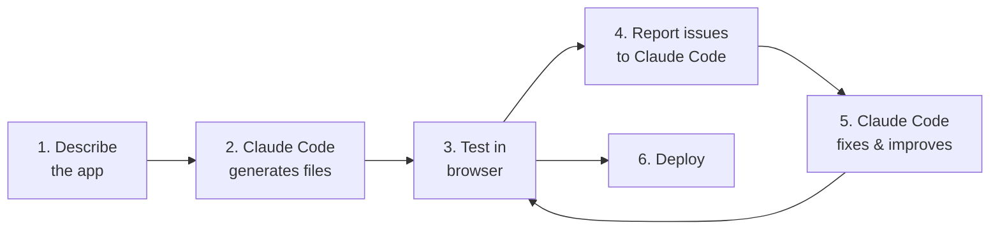

# Lab 022 – Claude Code: Building a Full-Stack App

!!! hint "Overview"

    - In this lab, you will use Claude Code to build a complete business application from scratch.
    - You will go from a text description to a working, deployed application.
    - You will practice iterative development: build → test → refine cycles.
    - By the end of this lab, you will have built a full supplier management system with Claude Code.

## Prerequisites

- Claude Code installed and configured (Labs 020-021)
- Supabase account
- GitHub account

## What You Will Learn

- Building multi-file projects with Claude Code
- Iterative development workflow
- Database schema design with AI
- Connecting frontend to Supabase backend
- Testing and debugging with Claude Code

---

## Background

### The Development Workflow



---

## Lab Steps

### Step 1 – Define the Application

Create a new project folder and start Claude Code:

```bash
mkdir ~/elcon-supplier-mgmt && cd ~/elcon-supplier-mgmt
claude
```

Give Claude Code the full specification:

```
Build a Supplier Management System for Elcon with these requirements:

PROJECT STRUCTURE:
- index.html (main app)
- css/styles.css (styling)
- js/app.js (application logic)
- js/supabase.js (database layer)
- js/utils.js (utility functions)
- README.md (documentation)

DATA MODEL (in Supabase):
- suppliers: id, name, contact_person, email, phone, category, country, rating (1-5), is_active, created_at
- supplier_notes: id, supplier_id, note_text, created_by, created_at
- supplier_documents: id, supplier_id, doc_name, doc_url, doc_type, uploaded_at

FEATURES:
1. Dashboard with KPIs: total suppliers, active %, average rating, by country chart
2. Supplier list with search, filter by category/country/rating/active status
3. Supplier detail view with notes timeline and documents
4. Add/edit supplier form with validation
5. Rating system (1-5 stars, clickable)
6. Export to CSV
7. Import from CSV
8. Responsive design (mobile-friendly)
9. Dark theme with professional look

TECH:
- Vanilla HTML/CSS/JS (no frameworks)
- Supabase for database (use CDN client)
- CSS variables for theming
- Font Awesome for icons
```

### Step 2 – Review the Generated Code

After Claude Code generates the files:

```
Show me the file structure you created and explain each file's purpose
```

Then:

```
Open index.html in the browser and tell me what you see.
List any issues or missing pieces.
```

### Step 3 – Iterative Improvements

Run improvement rounds:

**Round 1 – Visual Polish:**

```
The app looks good but needs visual improvements:
1. Add smooth transitions when filtering the table
2. The star rating should highlight on hover
3. Add a loading spinner when fetching data
4. Cards should have subtle hover effects
```

**Round 2 – Data Validation:**

```
Add proper form validation:
1. Email must be valid format
2. Phone must be digits, dashes, and + only
3. Name is required and min 2 characters
4. Show inline error messages (red text below each field)
5. Disable submit button until form is valid
```

**Round 3 – Advanced Features:**

```
Add these features:
1. Bulk operations: select multiple suppliers and change category/status
2. Duplicate detection: warn when adding a supplier with similar name
3. Activity log: track all changes (who, what, when)
4. Quick stats comparison: this month vs last month
```

### Step 4 – Database Setup

Ask Claude Code to generate the SQL:

```
Generate the Supabase SQL migration for all tables including:
- The tables from the data model
- Row Level Security policies
- Indexes for common queries
- Sample data (20 suppliers, various categories and countries)
```

### Step 5 – Connect and Deploy

```
Connect the app to Supabase:
- URL: https://xxx.supabase.co
- Anon key: eyJ...

Then create a vercel.json and prepare for deployment.
Also create a proper README.md with setup instructions.
```

---

## Tasks

!!! note "Task 1"
Build the supplier management system following all steps above. Time yourself – aim for under 30 minutes.

!!! note "Task 2"
Add a feature Claude Code didn't include: a "Favorites" system where users can star suppliers for quick access.

!!! note "Task 3"
Ask Claude Code to write a comprehensive README.md with screenshots placeholders and setup instructions.

---

## Summary

In this lab you:

- [x] Built a complete multi-file web application with Claude Code
- [x] Practiced iterative development (describe → generate → test → refine)
- [x] Generated database schemas and migrations
- [x] Connected frontend to Supabase backend
- [x] Prepared the app for deployment
