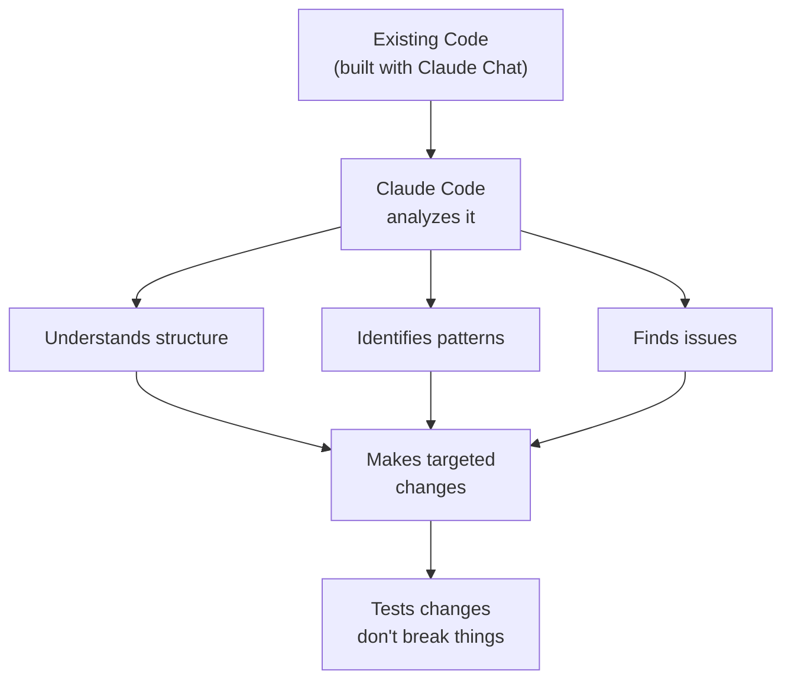
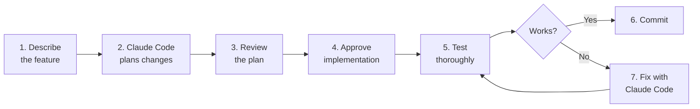

# Lab 023 – Claude Code: Working with Existing Code

!!! hint "Overview"

    - In this lab, you will use Claude Code to understand, modify, and extend existing codebases.
    - You will learn how to navigate unfamiliar code and make targeted changes.
    - You will practice debugging and fixing issues with Claude Code's help.
    - By the end of this lab, you will be confident working with code you didn't write.

## Prerequisites

- Claude Code installed (Lab 020)
- An existing project (from previous labs)

## What You Will Learn

- Analyzing and understanding existing code
- Making targeted changes without breaking things
- Debugging runtime errors with Claude Code
- Refactoring code for better organization
- Adding features to existing applications

---

## Background

### The "I Didn't Write This Code" Problem



---

## Lab Steps

### Step 1 – Analyze an Existing Project

Navigate to your Import Management app from Lab 003:

```bash
cd ~/your-import-management-project
claude
```

```
Analyze this entire project. Give me:
1. A file-by-file overview (what each file does)
2. The data model (what data is stored and how)
3. The main user flows (what can a user do)
4. Any code quality issues or bugs you notice
5. Security concerns
```

### Step 2 – Understand Before Changing

Before making changes, always ask:

```
I want to add email notifications when a PO status changes to "Shipped".
Before writing any code, explain:
1. Which files need to change
2. What functions are involved
3. What the impact would be on existing functionality
4. Any risks or side effects
```

### Step 3 – Make a Targeted Change

```
Now implement the email notification feature.
Only change the minimum necessary code.
Show me a diff of what you changed.
```

### Step 4 – Debug a Problem

Simulate a bug scenario:

```
When I click "Export to CSV", the file downloads but the dates are
in the wrong format (showing timestamps instead of DD/MM/YYYY).
Find the export function and fix the date formatting.
```

```
Users report that the search doesn't work when they type Hebrew characters.
Find and fix the search function to support Unicode/Hebrew text properly.
```

### Step 5 – Refactoring with Claude Code

```
This app has all JavaScript in a single file (3000+ lines).
Refactor it into separate modules:
- app.js (main initialization and routing)
- ui.js (DOM manipulation and rendering)
- data.js (Supabase operations)
- utils.js (helpers: formatting, validation, export)

Keep all functionality identical. Don't change any behavior.
```

### Step 6 – Adding Features Safely



---

## Tasks

!!! note "Task 1"
Take any app from previous labs and ask Claude Code to perform a full code review. Fix the top 3 issues it finds.

!!! note "Task 2"
Add a "Dashboard Widgets" feature to an existing app: users can drag and rearrange dashboard cards.

!!! note "Task 3"
Ask Claude Code to add comprehensive error handling to an existing app (try/catch, user-friendly error messages, error logging).

---

## Summary

In this lab you:

- [x] Analyzed and understood existing code with Claude Code
- [x] Made targeted changes without breaking functionality
- [x] Debugged runtime issues
- [x] Refactored code into better organized modules
- [x] Added features safely to existing applications
