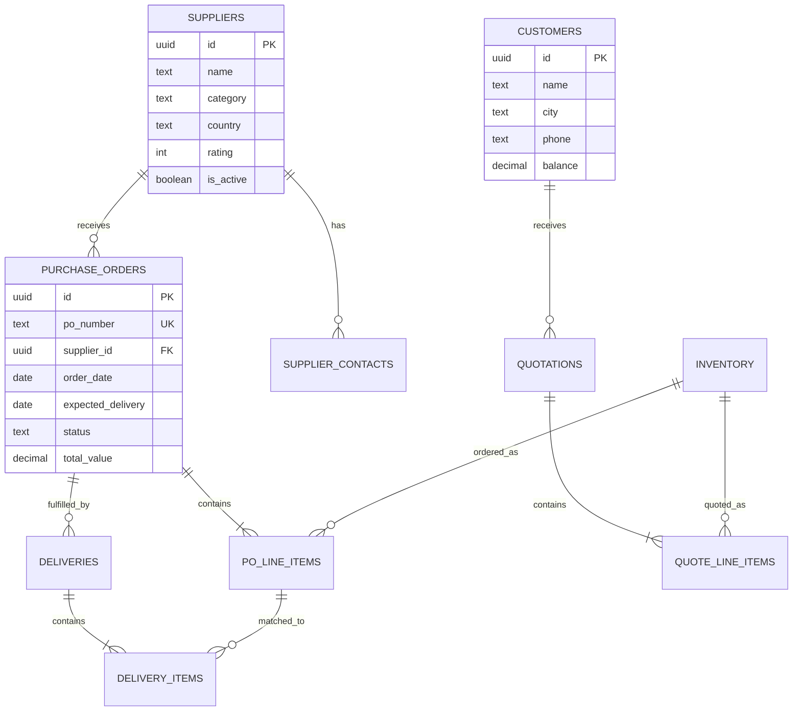

# Lab 024 – Claude Code: Database Design & SQL

!!! hint "Overview"

    - In this lab, you will use Claude Code to design database schemas, write SQL, and manage migrations.
    - You will build a normalized database for a real business use case.
    - You will learn to query, aggregate, and report on data using SQL generated by Claude Code.
    - By the end of this lab, you will have a production-ready database schema.

## Prerequisites

- Claude Code installed (Lab 020)
- Supabase project

## What You Will Learn

- Database design principles with AI assistance
- Generating SQL schemas and migrations
- Writing complex queries with Claude Code
- Creating database views for dashboards
- Setting up Row Level Security

---

## Lab Steps

### Step 1 – Design from Requirements

```bash
mkdir ~/elcon-db-design && cd ~/elcon-db-design
claude
```

```
Design a complete database schema for Elcon's operations. We need to track:

1. SUPPLIERS: company info, contacts, categories, ratings, payment terms
2. PURCHASE ORDERS: PO number, supplier, line items, status lifecycle, dates
3. DELIVERIES: what arrived, when, matched to PO line items, discrepancies
4. INVENTORY: parts catalog, current stock, reorder levels, locations
5. CUSTOMERS: company info, contacts, projects, order history
6. QUOTATIONS: quotes sent to customers, line items, status, follow-ups

Requirements:
- All tables need proper foreign keys and constraints
- Include audit fields (created_at, updated_at, created_by)
- Design for Supabase (PostgreSQL)
- Include CHECK constraints for status fields
- Add indexes for commonly queried fields

Generate the complete SQL migration file with:
- CREATE TABLE statements
- Foreign key relationships
- Indexes
- Enum-like CHECK constraints
- Comments explaining each table
```

### Step 2 – Visualize the Schema

```
Generate a mermaid ER diagram showing all tables and their relationships.
Use proper cardinality notation (one-to-many, many-to-many).
```

Expected output:



### Step 3 – Complex Queries

Ask Claude Code to write business queries:

```
Write SQL queries for these business reports:
1. Monthly purchase order summary (count, total value, by status)
2. Supplier performance: average delivery delay, order accuracy rate
3. Top 10 most ordered parts with total quantity and value
4. Overdue deliveries with supplier contact info
5. Customer quote conversion rate (quotes sent vs. orders received)
6. Inventory items below reorder level
7. Cash flow forecast: expected payments by week for next 3 months
```

### Step 4 – Database Views for Dashboards

```
Create PostgreSQL views for:
1. vw_supplier_dashboard: supplier name, total orders, total value, avg rating, last order date
2. vw_po_status_summary: count and value by status, overdue count
3. vw_monthly_trends: orders, deliveries, and value by month for last 12 months
4. vw_inventory_alerts: items below reorder level with supplier info and last PO date
```

### Step 5 – Row Level Security

```
Set up Row Level Security (RLS) for a multi-user environment:
- Admins can see and edit everything
- Procurement team can manage POs and suppliers
- Sales team can manage customers and quotations
- Viewers can only read data
Create the policies and test queries for each role.
```

---

## Tasks

!!! note "Task 1"
Use Claude Code to design a schema for your specific Elcon use case. Generate the full SQL migration.

!!! note "Task 2"
Write 5 business-critical queries and save them as a SQL file with comments explaining each.

!!! note "Task 3"
Create a database view that powers a KPI dashboard showing: total orders this month, total value, top supplier, overdue count.

---

## Summary

In this lab you:

- [x] Designed a normalized database schema with Claude Code
- [x] Generated ER diagrams with mermaid
- [x] Wrote complex business queries
- [x] Created database views for dashboards
- [x] Set up Row Level Security policies
