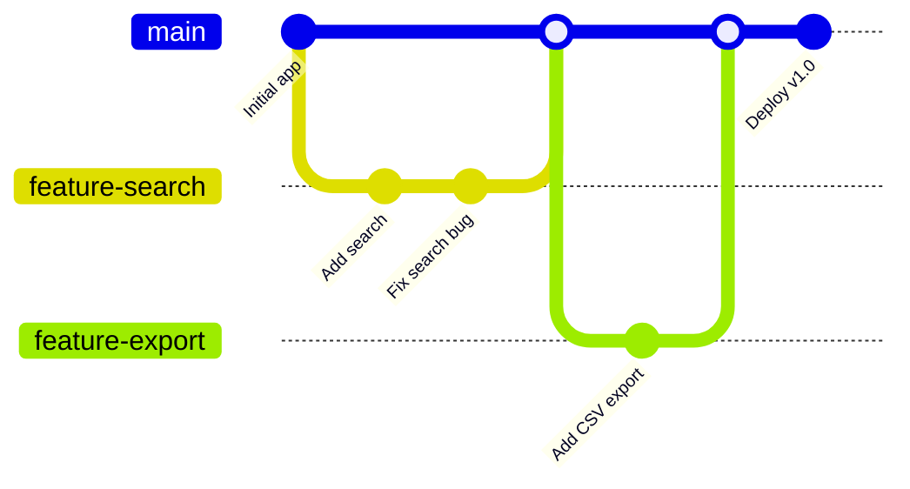
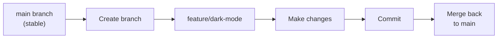
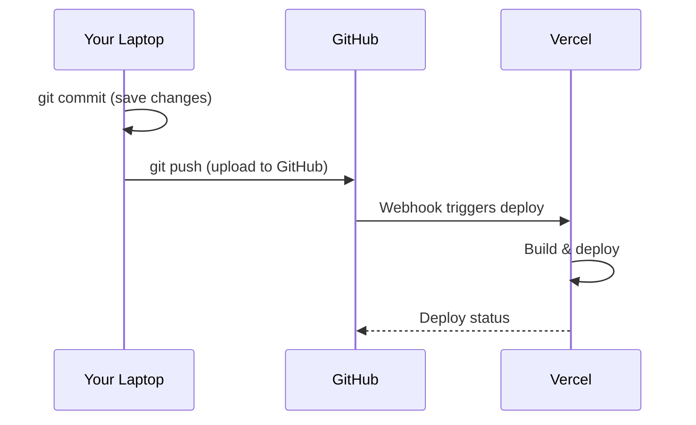

# Lab 025 – Claude Code: Git & Version Control

!!! hint "Overview"

    - In this lab, you will use Claude Code's built-in Git capabilities for version control.
    - You will learn branching, committing, and managing code changes safely.
    - You will practice the workflow of creating features on branches and merging them.
    - By the end of this lab, you will never lose your work again.

## Prerequisites

- Claude Code installed (Lab 020)
- GitHub account
- A project with a Git repository

## What You Will Learn

- Git basics through Claude Code
- Creating and managing branches
- Meaningful commit messages
- Using Git to safely experiment
- Pushing to GitHub and collaboration basics

---

## Background

### The Git Safety Net



---

## Lab Steps

### Step 1 – Initialize a Git Repository

```bash
cd ~/your-project
claude
```

```
Initialize a Git repository for this project:
1. Create a .gitignore file appropriate for a web project
2. Make an initial commit with all current files
3. Create a GitHub repository and push
```

### Step 2 – Feature Branches

```
Create a new branch called "feature/dark-mode" and implement a dark mode toggle.
Commit the changes with a meaningful message.
```



### Step 3 – Commit Messages with Claude Code

```
Review all uncommitted changes and create a proper commit.
Use conventional commit format: type(scope): description
Types: feat, fix, docs, style, refactor, test, chore
```

Claude Code generates messages like:

- `feat(dashboard): add monthly revenue chart`
- `fix(search): handle Hebrew Unicode characters correctly`
- `docs(readme): add setup instructions and screenshots`

### Step 4 – Recovering from Mistakes

```
I accidentally deleted the export function.
Show me how to recover it from the last commit.
```

```
I want to undo my last 2 commits but keep the changes as uncommitted files.
Show me the command and explain what it does.
```

### Step 5 – GitHub Workflow



---

## Tasks

!!! note "Task 1"
Create a new project with Git, make 5 meaningful commits, and push to GitHub.

!!! note "Task 2"
Create a feature branch, add a new feature, then merge it back to main using Claude Code.

!!! note "Task 3"
Intentionally break something, then use `git diff` and `git checkout` to recover. Practice with Claude Code guiding you.

---

## Summary

In this lab you:

- [x] Initialized Git repositories with Claude Code
- [x] Created and merged feature branches
- [x] Generated meaningful commit messages
- [x] Recovered from mistakes using Git
- [x] Pushed to GitHub for backup and deployment
