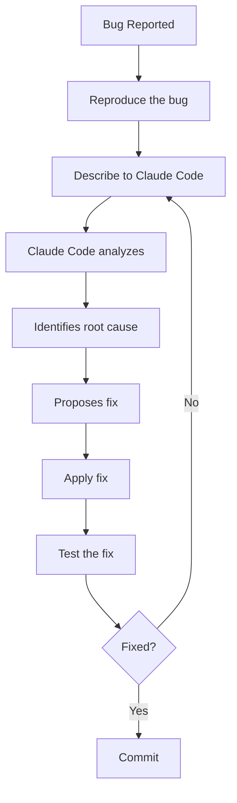

# Lab 026 – Claude Code: Testing & Debugging

!!! hint "Overview"

    - In this lab, you will use Claude Code to find bugs, debug issues, and write tests.
    - You will learn systematic debugging techniques with AI assistance.
    - You will generate test cases for your business logic.
    - By the end of this lab, you will be able to diagnose and fix any issue in your apps.

## Prerequisites

- Claude Code installed (Lab 020)
- An existing app with some bugs (or we'll introduce them)

## What You Will Learn

- Systematic debugging with Claude Code
- Reading and understanding error messages
- Writing test cases for business logic
- Browser DevTools basics
- Common bug patterns and how to fix them

---

## Background

### The Debugging Process



---

## Lab Steps

### Step 1 – Common Bug Patterns

Ask Claude Code to find common issues:

```
Review this project for these common bug patterns:
1. Unhandled null/undefined values
2. Missing error handling on async operations
3. Race conditions in data loading
4. Memory leaks (event listeners not removed)
5. XSS vulnerabilities in user input display
6. Incorrect date handling (timezone issues)
```

### Step 2 – Debugging with Error Messages

When you get a JavaScript error, paste it to Claude Code:

```
I'm getting this error in the browser console:
"Uncaught TypeError: Cannot read properties of undefined (reading 'map')"

The error points to line 142 in app.js.
Find the bug and fix it.
```

### Step 3 – Writing Tests

```
Write test cases for the purchase order validation logic:

Test cases should cover:
1. Valid PO with all required fields → should pass
2. Missing supplier → should fail with "Supplier is required"
3. Negative quantity → should fail with "Quantity must be positive"
4. Expected delivery before order date → should fail
5. Total exceeding $1,000,000 → should warn (not fail)
6. Duplicate PO number → should fail

Generate a test file using plain JavaScript (no testing framework needed).
Each test should print PASS or FAIL with the test description.
```

### Step 4 – Browser DevTools Debugging

Claude Code can guide you through DevTools:

```
I need to debug why the supplier filter is slow.
Walk me through using Chrome DevTools to:
1. Open the Performance tab and record
2. Identify which function is taking the longest
3. Find the bottleneck
Then suggest an optimization.
```

### Step 5 – Automated Health Checks

```
Create a health-check script that verifies:
1. Supabase connection is working
2. All required tables exist
3. Sample query returns results
4. API response time is under 2 seconds
5. All UI elements render correctly (DOM check)

The script should run on page load (in dev mode) and show a green/red
status panel in the bottom-right corner.
```

---

## Tasks

!!! note "Task 1"
Ask Claude Code to review an existing app for bugs. Fix the top 3 issues found.

!!! note "Task 2"
Write a test suite with at least 10 test cases for your most important business logic.

!!! note "Task 3"
Create a health-check page (`health.html`) that tests connectivity and reports system status.

---

## Summary

In this lab you:

- [x] Learned systematic debugging with Claude Code
- [x] Identified common bug patterns in web apps
- [x] Wrote test cases for business logic
- [x] Used browser DevTools for performance debugging
- [x] Created automated health checks
