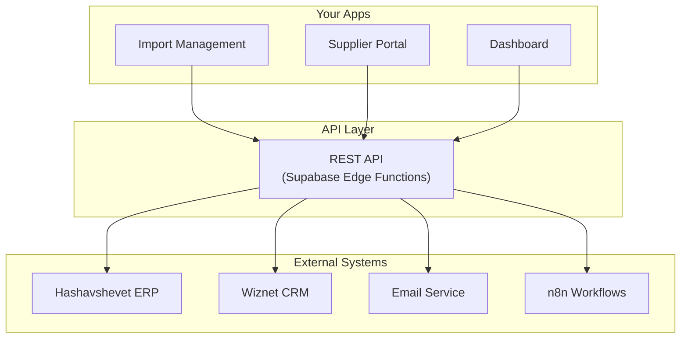
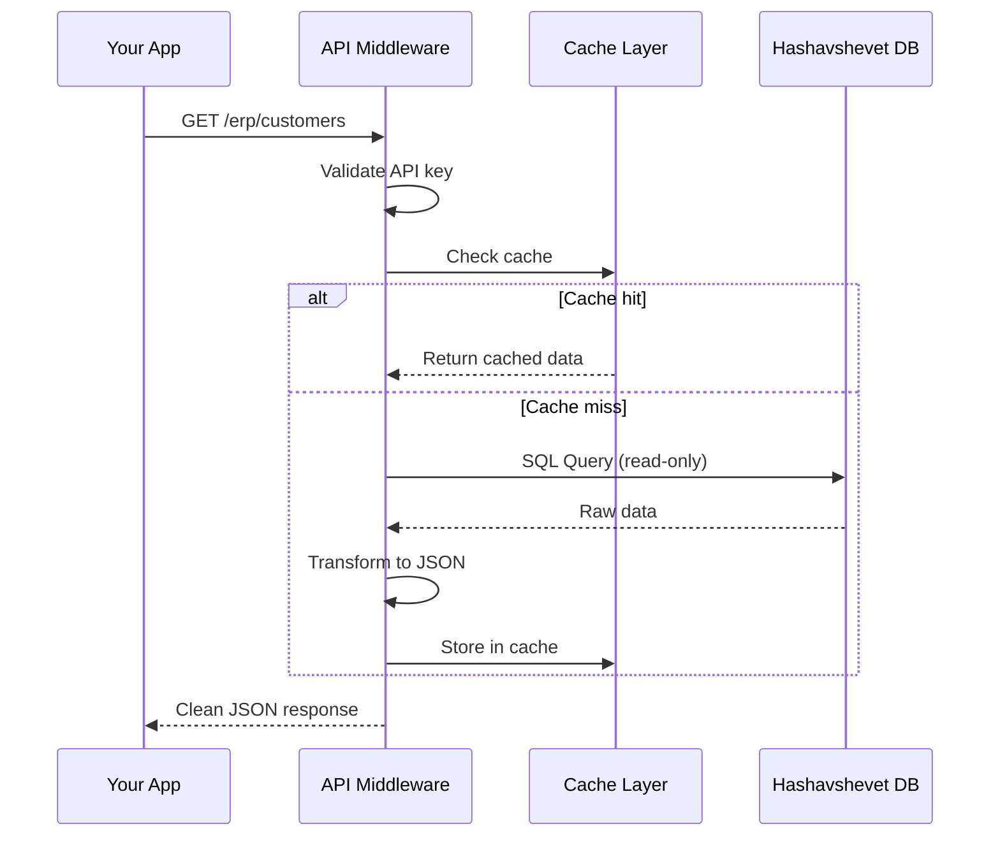

# Lab 027 – Claude Code: API Development

!!! hint "Overview"

    - In this lab, you will use Claude Code to build APIs that connect your apps to external systems.
    - You will create a simple Node.js API server using Supabase Edge Functions.
    - You will learn about REST APIs, webhooks, and middleware.
    - By the end of this lab, your apps will be able to communicate with other systems.

## Prerequisites

- Claude Code installed (Lab 020)
- Supabase project
- Basic understanding of HTTP (GET, POST)

## What You Will Learn

- What APIs are and why they matter
- Building REST endpoints with Supabase Edge Functions
- Creating webhooks for system integration
- Middleware for ERP access
- API security basics

---

## Background

### APIs Connect Everything



---

## Lab Steps

### Step 1 – Create a Supabase Edge Function

```bash
mkdir ~/elcon-api && cd ~/elcon-api
claude
```

```
Create a Supabase Edge Function that provides a REST API for suppliers:
- GET /suppliers - list all suppliers (with pagination and search)
- GET /suppliers/:id - get a single supplier with notes and orders
- POST /suppliers - create a new supplier
- PATCH /suppliers/:id - update a supplier
- DELETE /suppliers/:id - soft-delete (set is_active=false)

Include:
- Input validation
- Error handling with proper HTTP status codes
- CORS headers
- Rate limiting (max 100 requests per minute)
```

### Step 2 – Build a Webhook Receiver

```
Create an Edge Function that acts as a webhook receiver:
- POST /webhooks/delivery-note
  - Receives JSON: { po_number, items[], delivery_date, carrier }
  - Validates the data
  - Matches to existing PO
  - Updates PO status to "Received"
  - Creates delivery record
  - Returns confirmation

This will be called by n8n when a delivery note is scanned.
```

### Step 3 – ERP Middleware API

```
Design an API middleware that safely exposes Hashavshevet ERP data:
- GET /erp/customers - customer list
- GET /erp/invoices?month=2026-04 - invoices for a month
- GET /erp/balance/:customer_id - customer balance

The middleware should:
1. Accept only read-only requests
2. Cache responses for 5 minutes
3. Transform ERP data format to clean JSON
4. Log all access for auditing
5. Require API key authentication
```



### Step 4 – API Documentation

```
Generate OpenAPI/Swagger documentation for all the APIs we created.
Include:
- Endpoint descriptions
- Request/response examples
- Authentication requirements
- Error codes
Also create a simple HTML API docs page.
```

---

## Tasks

!!! note "Task 1"
Build a REST API for one Elcon entity (suppliers, orders, or customers) using Supabase Edge Functions.

!!! note "Task 2"
Create a webhook that receives data from n8n and processes it (validate, transform, store).

!!! note "Task 3"
Generate API documentation and test all endpoints using `curl` commands from Claude Code.

---

## Summary

In this lab you:

- [x] Built REST APIs with Supabase Edge Functions
- [x] Created webhook receivers for system integration
- [x] Designed ERP middleware with caching and security
- [x] Generated API documentation
