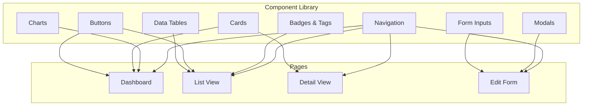

# Lab 028 – Claude Code: UI/UX Design with AI

!!! hint "Overview"

    - In this lab, you will use Claude Code to create professional, user-friendly interfaces.
    - You will learn CSS techniques, responsive design, and accessibility basics.
    - You will build reusable UI components for your Elcon apps.
    - By the end of this lab, your apps will look polished and professional.

## Prerequisites

- Claude Code installed (Lab 020)
- Basic understanding of HTML/CSS

## What You Will Learn

- Modern CSS techniques (flexbox, grid, variables)
- Responsive design for mobile and desktop
- Building a component library
- Dark/light theme support
- Accessibility basics

---

## Background

### The UI Component Architecture



---

## Lab Steps

### Step 1 – Create a Design System

```bash
mkdir ~/elcon-ui && cd ~/elcon-ui
claude
```

```
Create an Elcon Design System with these files:
- css/variables.css (color palette, spacing, typography)
- css/components.css (reusable UI components)
- css/layout.css (grid system and page layouts)
- components.html (showcase page demonstrating all components)

Design tokens:
- Primary: #2563eb (blue)
- Success: #16a34a (green)
- Warning: #f59e0b (amber)
- Danger: #dc2626 (red)
- Background: #0f172a (dark navy)
- Surface: #1e293b (dark slate)
- Text: #e2e8f0 (light gray)
- Font: "Inter" from Google Fonts

Components needed:
1. Buttons (primary, secondary, danger, ghost, sizes: sm/md/lg)
2. Cards (standard, stat card with icon and number, clickable)
3. Data table (sortable headers, striped rows, row hover, pagination)
4. Form inputs (text, select, date, textarea, file upload, toggle)
5. Modals (standard, confirmation dialog, full-screen)
6. Navigation (sidebar, topbar, breadcrumbs)
7. Badges (status: active/inactive/pending, priority: low/med/high)
8. Toast notifications (success, error, warning, info)
9. Search bar with filters dropdown
10. Tabs (horizontal, underline style)
```

### Step 2 – Responsive Design

```
Make all components responsive:
- Mobile (< 640px): single column, hamburger menu, cards stack vertically
- Tablet (640-1024px): two columns, collapsible sidebar
- Desktop (> 1024px): full layout with sidebar

Use CSS Grid and Flexbox. No media query should be wider than necessary.
Add the responsive showcase to components.html.
```

### Step 3 – Interactive Dashboard

```
Using the design system, create a complete dashboard page (dashboard.html):
- Top bar with search, notifications bell, user avatar
- Sidebar navigation with icons
- KPI cards row: 4 stat cards with trend arrows
- Charts section: bar chart (orders by month), donut chart (by status)
- Recent activity feed
- Quick actions panel

Use CSS-only charts (no JavaScript library needed for basic shapes).
For real charts, use Chart.js via CDN.
```

### Step 4 – Accessibility

```
Audit all components for accessibility (a11y):
1. All interactive elements must be keyboard navigable
2. Color contrast must meet WCAG AA (4.5:1 for text)
3. Add proper ARIA labels to icons and interactive elements
4. Form inputs must have associated labels
5. Focus states must be visible
6. Screen reader announcements for toast notifications
```

---

## Tasks

!!! note "Task 1"
Build the complete design system and showcase page. Verify all components look correct.

!!! note "Task 2"
Create a responsive dashboard page using the design system. Test on mobile (Chrome DevTools device mode).

!!! note "Task 3"
Add dark/light theme toggle. Both themes should look professional and maintain readability.

---

## Summary

In this lab you:

- [x] Created a reusable design system with CSS variables
- [x] Built 10+ UI components
- [x] Implemented responsive design for all screen sizes
- [x] Created a professional dashboard layout
- [x] Learned accessibility basics
