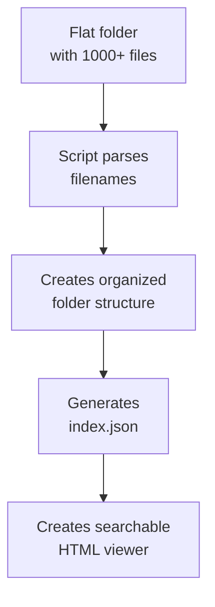
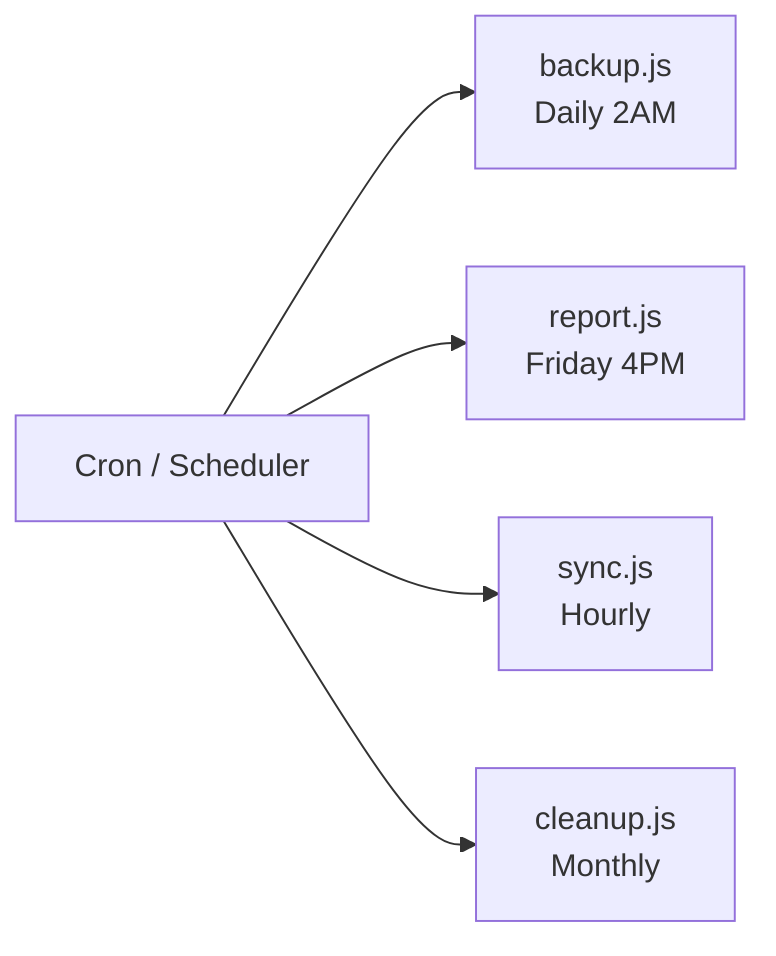

# Lab 029 – Claude Code: Automation Scripts

!!! hint "Overview"

    - In this lab, you will use Claude Code to write automation scripts for common business tasks.
    - You will automate data processing, file management, and report generation.
    - You will learn to use Claude Code for shell scripts and batch operations.
    - By the end of this lab, you will have scripts that save hours of manual work.

## Prerequisites

- Claude Code installed (Lab 020)
- Terminal/command line basics

## What You Will Learn

- Writing automation scripts with Claude Code
- Data processing: CSV, JSON, Excel files
- File management automation
- Report generation scripts
- Scheduled task setup

---

## Lab Steps

### Step 1 – CSV Data Processing

```bash
mkdir ~/elcon-scripts && cd ~/elcon-scripts
claude
```

```
Create a data processing toolkit with these scripts:

1. csv-import.js
   - Reads a CSV file of suppliers
   - Validates each row (required fields, email format, phone format)
   - Reports errors with line numbers
   - Uploads valid records to Supabase
   - Creates an error log for invalid records

2. csv-export.js
   - Exports Supabase data to CSV
   - Supports filtering: --status active --category Electronics
   - Adds a header row
   - Formats dates as DD/MM/YYYY
   - Handles Hebrew text correctly (UTF-8 BOM)

3. data-sync.js
   - Compares two CSV files (old vs new)
   - Reports: added, removed, changed records
   - Generates a diff report
```

### Step 2 – File Organization Script

```
Create a script that organizes Elcon's drawing files:

Input: A folder with files like:
  /drawings/
    Customer_A_Panel_Rev3.dwg
    Customer_B_Schematic_Rev1.pdf
    Customer_A_Wiring_Rev2.pdf
    ...

The script should:
1. Parse filenames to extract: customer, type, revision
2. Create organized folder structure:
   /drawings/
     Customer_A/
       Panel/
         Rev3/Panel_Rev3.dwg
       Wiring/
         Rev2/Wiring_Rev2.pdf
     Customer_B/
       Schematic/
         Rev1/Schematic_Rev1.pdf
3. Generate an index.json with all drawings metadata
4. Create a searchable HTML page that reads index.json
```



### Step 3 – Report Generator

```
Create a weekly report generator:
1. Queries Supabase for this week's data
2. Calculates KPIs:
   - New POs created
   - POs completed
   - Average delivery time
   - Top suppliers by volume
   - Overdue orders
3. Generates an HTML report with charts
4. Generates a PDF version
5. Sends via email (using Supabase Edge Function)

The report should be branded with Elcon's logo and colors.
```

### Step 4 – Batch Operations

```
Create batch operation scripts:
1. bulk-update.js - Update multiple records from a CSV
2. bulk-email.js - Send personalized emails to suppliers from a template
3. backup.js - Export all Supabase tables to JSON files with timestamps
4. cleanup.js - Archive records older than 1 year, remove soft-deleted items
```

### Step 5 – Scheduling



---

## Tasks

!!! note "Task 1"
Build the CSV import/export toolkit. Test with a real supplier list CSV file.

!!! note "Task 2"
Create the file organization script. Test with a sample folder of 50+ files.

!!! note "Task 3"
Build the weekly report generator. Generate a sample report for the current week.

---

## Summary

In this lab you:

- [x] Created CSV processing scripts for import/export
- [x] Built a file organization automation
- [x] Generated branded HTML/PDF reports
- [x] Wrote batch operation scripts
- [x] Learned how to schedule automated tasks
