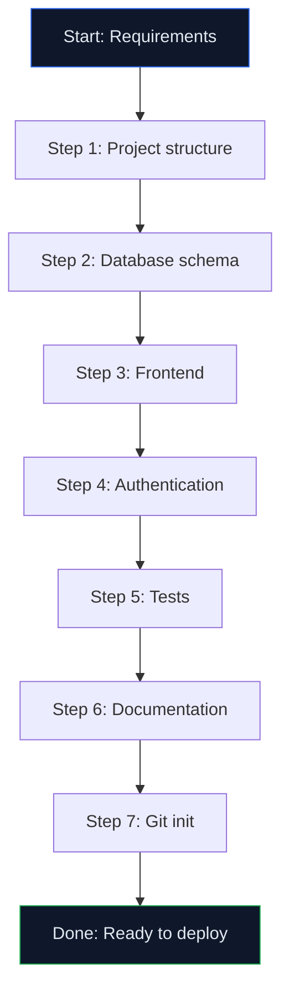

# Lab 030 – Claude Code: Advanced Patterns & Best Practices

!!! hint "Overview"

    - In this lab, you will learn advanced Claude Code patterns for complex projects.
    - You will understand slash commands, tool use, and multi-step workflows.
    - You will build a complete project template for future Elcon apps.
    - By the end of this lab, you will be a Claude Code power user.

## Prerequisites

- All Claude Code labs completed (020-029)

## What You Will Learn

- Advanced Claude Code slash commands
- Multi-step autonomous workflows
- Project templates and boilerplates
- Performance optimization with AI
- Claude Code limitations and workarounds

---

## Lab Steps

### Step 1 – Advanced Slash Commands

| Command        | What It Does                              |
| -------------- | ----------------------------------------- |
| `/init`        | Initialize a project with CLAUDE.md       |
| `/memory`      | Manage persistent memories                |
| `/compact`     | Compress conversation to save context     |
| `/cost`        | Show token usage and estimated cost       |
| `/doctor`      | Diagnose Claude Code configuration issues |
| `/review`      | Run a code review on staged changes       |
| `/pr-comments` | Show and address PR review comments       |
| `/clear`       | Reset conversation history                |

### Step 2 – Multi-Step Autonomous Workflow

```
I need you to build a complete employee directory app. Work autonomously:

1. Create the project structure (HTML, CSS, JS files)
2. Set up Supabase tables (employees, departments, skills)
3. Build the frontend with search, filters, and org chart
4. Add authentication (Supabase Auth)
5. Write tests for the main business logic
6. Generate README with setup instructions
7. Initialize Git and make the first commit

Work through each step. If you need clarification, ask.
Otherwise, proceed autonomously and report what you did at each step.
```



### Step 3 – Create an Elcon App Template

```
Create a reusable project template for Elcon web apps:

template/
├── index.html          # Main app with standard layout
├── login.html          # Authentication page
├── css/
│   ├── variables.css   # Elcon design tokens
│   ├── components.css  # Reusable components
│   └── layout.css      # Page layouts
├── js/
│   ├── app.js         # Main app initialization
│   ├── auth.js        # Supabase authentication
│   ├── db.js          # Database operations layer
│   ├── ui.js          # DOM manipulation
│   └── utils.js       # Utility functions
├── CLAUDE.md           # Claude Code project instructions
├── README.md           # Project documentation template
├── .gitignore          # Standard ignores
└── package.json        # For scripts and metadata

The template should include:
- Elcon branding (dark theme, colors, logo placeholder)
- Supabase connection boilerplate
- Authentication flow (login/logout/session check)
- Standard layout: sidebar + topbar + content area
- Toast notification system
- Loading states
- Error handling
- Responsive breakpoints
```

### Step 4 – Performance Optimization

```
Review my app and optimize for performance:
1. Minimize DOM operations (batch updates)
2. Debounce search input (300ms)
3. Virtual scrolling for tables with 1000+ rows
4. Lazy load images and heavy content
5. Cache Supabase queries (avoid repeated calls)
6. Minimize CSS and JS file sizes
Show me before/after comparisons for each optimization.
```

### Step 5 – Known Limitations & Workarounds

| Limitation               | Workaround                                     |
| ------------------------ | ---------------------------------------------- |
| Context window fills up  | Use `/compact` to compress history             |
| Can't run browser        | Test manually, describe results to Claude Code |
| Large files (>500 lines) | Split into modules first                       |
| Binary files (images)    | Describe what you need, provide URLs           |
| Network requests         | Claude Code can run curl/fetch in scripts      |
| Real-time debugging      | Copy error messages to Claude Code             |

---

## Tasks

!!! note "Task 1"
Build a complete app autonomously using Claude Code's multi-step workflow. Measure total time.

!!! note "Task 2"
Create the Elcon app template and use it to bootstrap a new project in under 5 minutes.

!!! note "Task 3"
Optimize an existing app's performance. Document the improvements with before/after metrics.

---

## Summary

In this lab you:

- [x] Mastered advanced Claude Code slash commands
- [x] Built a complete app using autonomous multi-step workflow
- [x] Created a reusable project template for Elcon
- [x] Optimized app performance with AI guidance
- [x] Understood Claude Code limitations and workarounds

---

!!! success "Claude Code Section Complete 🎉"

    You now have comprehensive skills in Claude Code.
    Next: n8n deep-dive labs (031-040).
