# Final Project – Building a CRM with Claude Code + n8n

!!! hint "Overview"

    - In this project, you will build a complete Customer Relationship Management (CRM) system.
    - The frontend and backend are built with **Claude Code** (Supabase + Next.js).
    - The automation layer is built with **n8n** (workflows, notifications, AI).
    - This is a real-world project that combines everything you learned in this course.
    - Work through it step by step – each phase builds on the previous one.

## Project Architecture

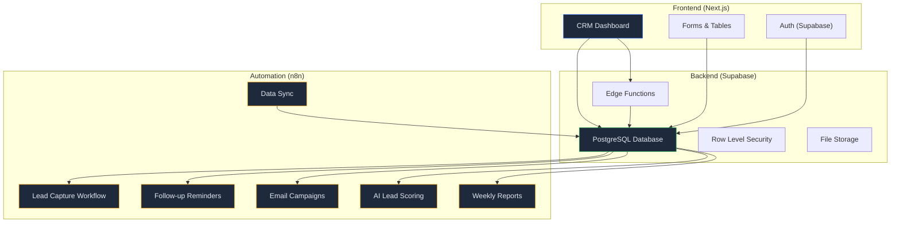

---

## Phase 1: Database Design (Claude Code)

### Database Schema

Use Claude Code to generate the entire database:

```bash
claude "Design and create a Supabase database for a CRM system for Elcon,
an instrumentation and control company. Include these tables with proper
relationships, constraints, and RLS policies:

1. contacts - customers/leads (name, email, phone, company, position, source)
2. companies - organizations (name, industry, size, website, address)
3. deals - sales opportunities (title, value, stage, probability, expected_close)
4. activities - tasks/calls/meetings (type, subject, date, notes, linked to contact/deal)
5. notes - free-text notes linked to contacts/companies/deals
6. email_log - sent/received emails tracked
7. tags - flexible tagging system for contacts/companies/deals

Use proper foreign keys, indexes, timestamps, soft delete.
Set up RLS for multi-user access based on auth.uid().
Create views for common queries (pipeline summary, overdue activities).
Generate seed data: 20 companies, 50 contacts, 30 deals, 100 activities."
```

### Expected ER Diagram

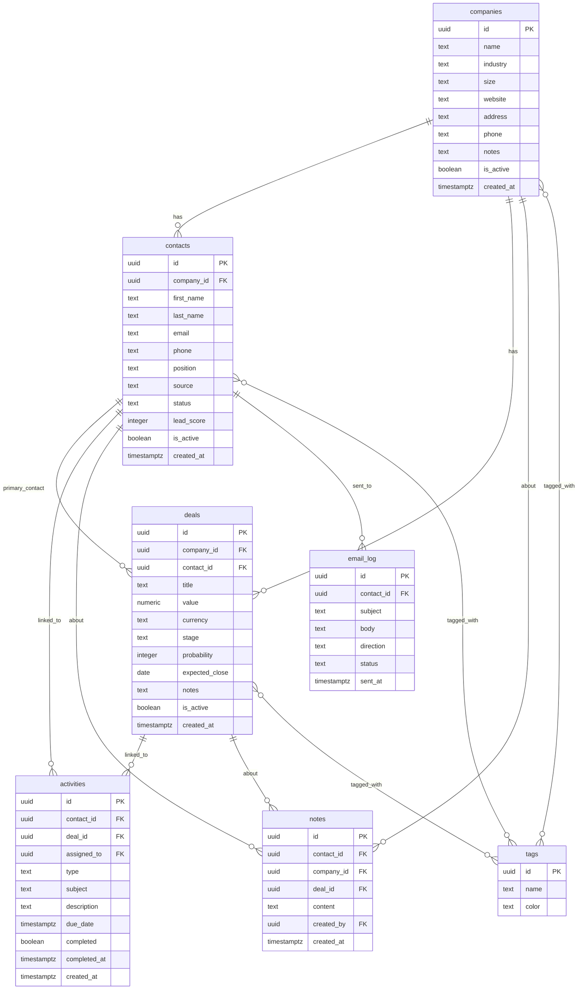

---

## Phase 2: Backend API (Claude Code)

Build the API layer with Claude Code:

```bash
claude "Create Supabase Edge Functions for the CRM:

1. /api/contacts - CRUD + search + filter by company/tag/status
2. /api/companies - CRUD + search + filter by industry/size
3. /api/deals - CRUD + pipeline view + move between stages
4. /api/activities - CRUD + list overdue + list by contact/deal
5. /api/dashboard - Summary stats (total contacts, deals by stage, revenue forecast)
6. /api/search - Global search across contacts, companies, deals

Each endpoint should handle GET (list/search), POST (create), PATCH (update), DELETE (soft delete).
Add pagination, sorting, and filtering support.
Return proper error responses with status codes."
```

### Deal Pipeline Stages

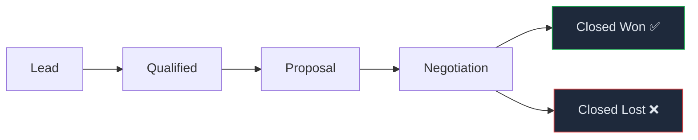

---

## Phase 3: Frontend Dashboard (Claude Code)

Build the UI with Claude Code:

```bash
claude "Build a Next.js CRM dashboard with Supabase auth:

Pages:
1. /dashboard - KPI cards (contacts, deals, revenue), pipeline chart, recent activities
2. /contacts - Table with search/filter/sort, click to view detail
3. /contacts/[id] - Contact detail with timeline, deals, activities, notes
4. /companies - Company list with contacts count, total deal value
5. /deals - Kanban board view of deal pipeline (drag between stages)
6. /activities - Activity list with calendar view, overdue highlighted
7. /reports - Charts: revenue forecast, deal conversion, activity metrics

Components:
- Layout with sidebar navigation
- Search bar with global search
- KPI cards with sparklines
- Data tables with pagination
- Kanban board for deals
- Activity timeline
- Notes editor
- Tag manager

Use shadcn/ui components, Tailwind CSS, dark mode.
Connect to Supabase for auth and data.
Use React Query for data fetching."
```

### Dashboard Wireframe

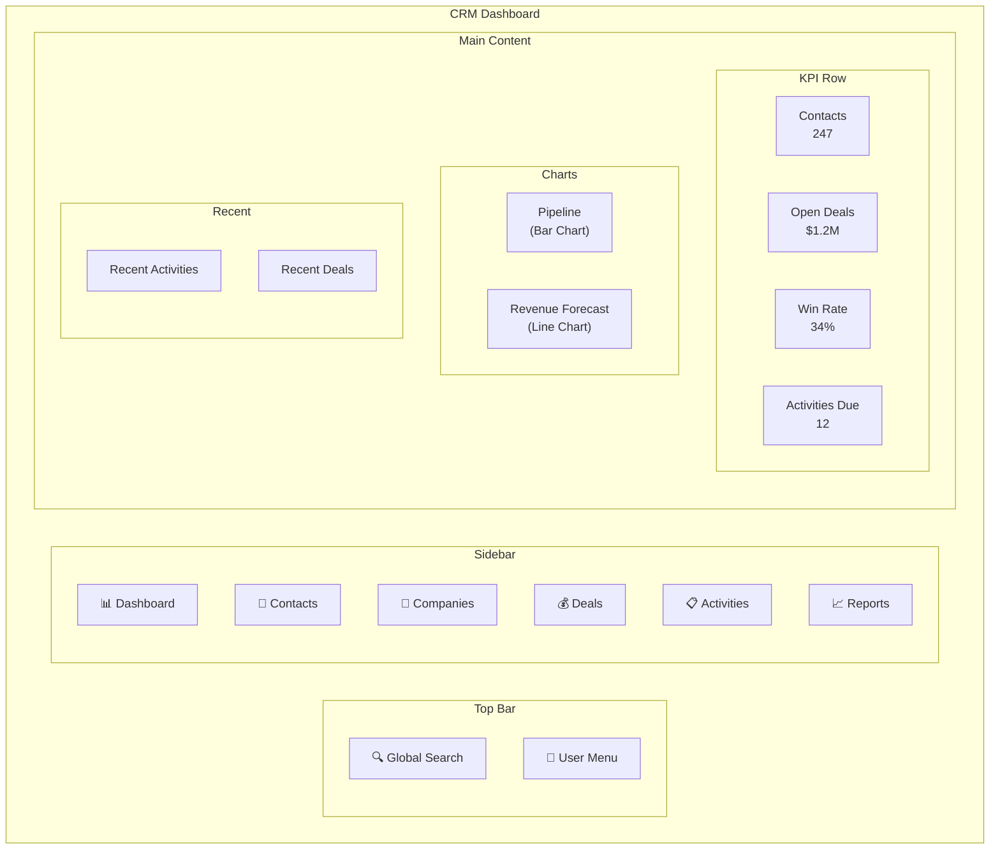

---

## Phase 4: n8n Automation Workflows

### Workflow 1: Lead Capture

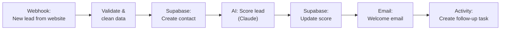

**n8n implementation:**

1. **Webhook** – POST `/webhook/lead/capture`
2. **Code** – Validate: name, email required; clean phone format
3. **Supabase** – Insert to `contacts` table
4. **HTTP Request** – Call Claude API:
   ```
   Score this lead 1-100 based on:
   - Company size and industry match (Elcon targets industrial/manufacturing)
   - Position seniority
   - Source quality (referral > website > cold)
   Return JSON: { score: number, reasoning: string }
   ```
5. **Supabase** – Update `lead_score`
6. **Send Email** – Templated welcome email
7. **Supabase** – Create activity: "Follow up with new lead" due in 2 days

### Workflow 2: Follow-up Reminders

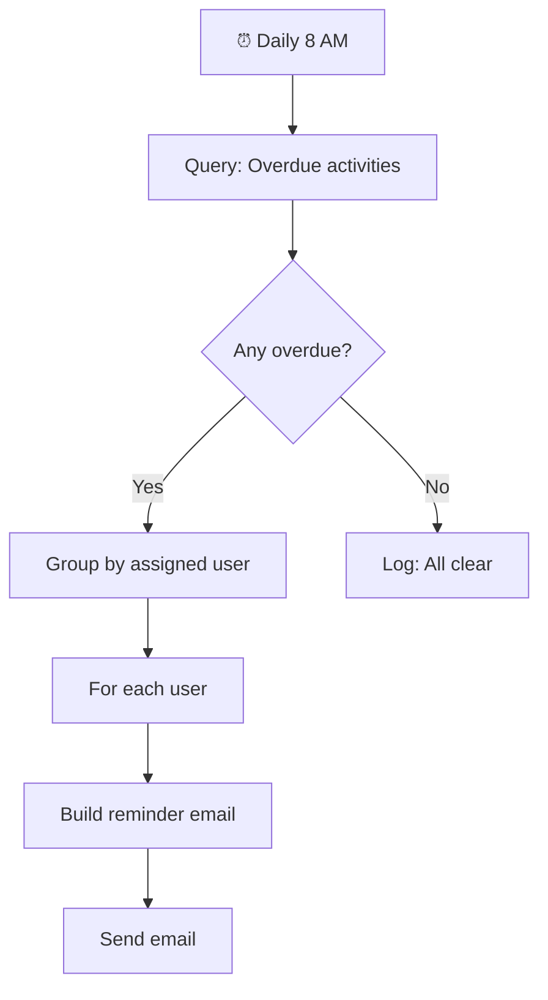

### Workflow 3: AI Deal Analysis

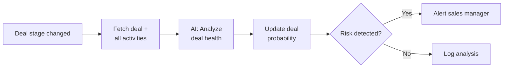

**AI prompt for deal analysis:**

```
Analyze this sales deal for Elcon (instrumentation company):

Deal: {{ $json.title }} - {{ $json.value }} {{ $json.currency }}
Stage: {{ $json.stage }}
Days in pipeline: {{ $json.days_open }}
Expected close: {{ $json.expected_close }}
Activities: {{ JSON.stringify($json.activities) }}
Last contact: {{ $json.last_activity_date }}

Assess:
1. Deal health (HEALTHY / AT_RISK / CRITICAL)
2. Adjusted win probability (0-100)
3. Risk factors (list)
4. Recommended next actions (list)
5. Predicted close date

Return as JSON.
```

### Workflow 4: Weekly CRM Report

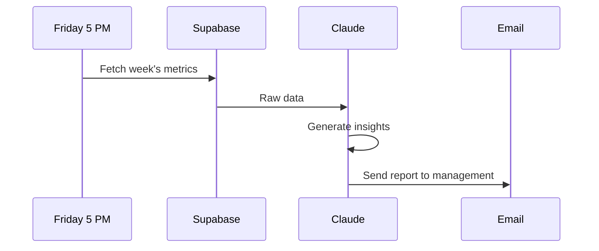

### Workflow 5: Data Enrichment

Automatically enrich new companies:

1. **Trigger** – New company created
2. **HTTP Request** – Look up company info (website scraping or API)
3. **AI** – Extract: industry, size, key products, relevant contacts
4. **Supabase** – Update company record
5. **Activity** – Create "Review enriched data" task

### Workflow 6: Email Tracking

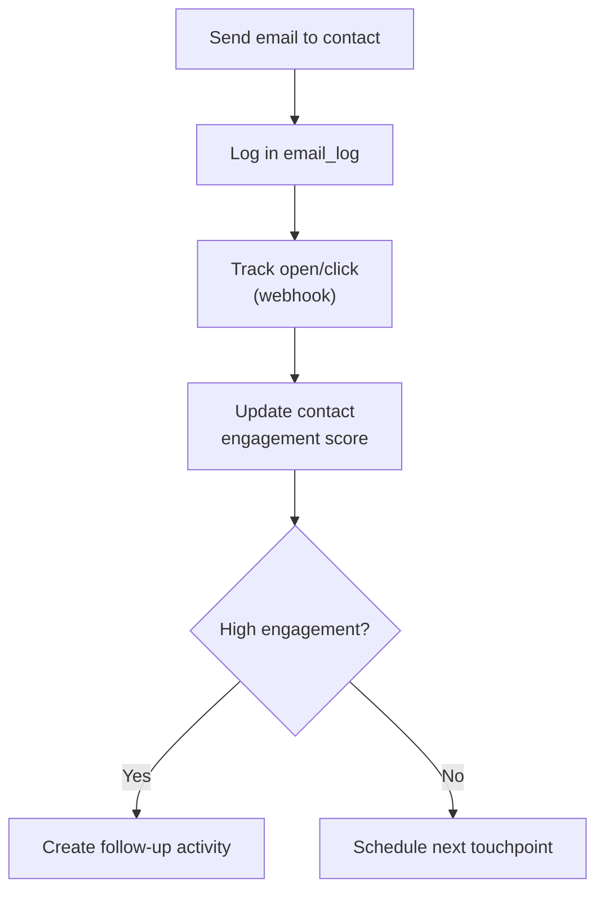

---

## Phase 5: Integration & Testing

### Connect Frontend to n8n

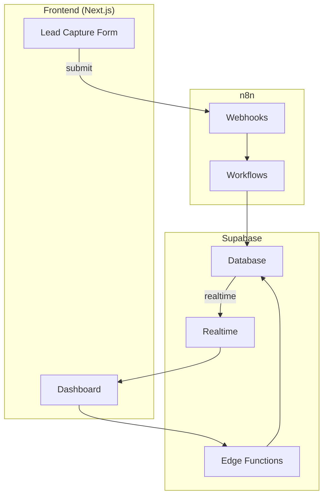

### Testing Checklist

| Test                    | How to Verify                                   |
| ----------------------- | ----------------------------------------------- |
| Lead capture end-to-end | Submit form → check DB → check welcome email    |
| Deal pipeline Kanban    | Drag deal → check stage updated → check n8n     |
| Activity reminders      | Create overdue activity → wait for 8 AM → email |
| AI lead scoring         | Submit lead → check score updated in DB         |
| Weekly report           | Trigger manually → check email received         |
| Global search           | Search by name → verify results from all tables |

---

## Phase 6: Deploy & Launch

### Deployment Architecture

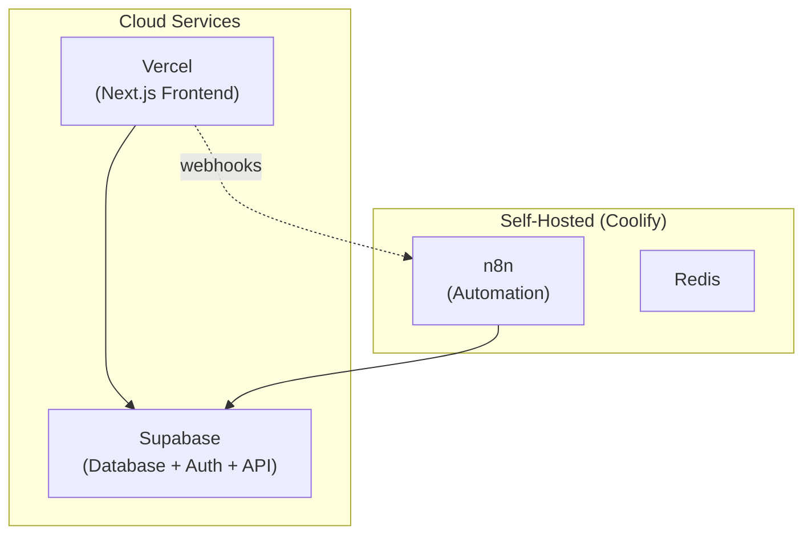

**Deployment steps:**

1. **Supabase** – Already hosted (apply migrations)
2. **Vercel** – Connect GitHub repo, auto-deploy
3. **n8n** – Deploy on Coolify with Docker Compose
4. **DNS** – Set up custom domains
5. **Monitoring** – n8n self-monitoring workflow
6. **Backup** – Automated daily backups

---

## Deliverables

By the end of this project, you should have:

- [ ] **Database**: Full CRM schema in Supabase with RLS, views, and seed data
- [ ] **API**: Edge Functions for CRUD operations on all entities
- [ ] **Frontend**: Next.js dashboard with all pages (contacts, companies, deals, activities, reports)
- [ ] **Automation**: 6 n8n workflows (lead capture, reminders, AI scoring, reports, enrichment, email tracking)
- [ ] **Integration**: Frontend connected to n8n via webhooks, Supabase realtime updates
- [ ] **Deployment**: Everything deployed and running on cloud services

---

## Bonus Challenges

!!! tip "Extra Credit"

    1. **WhatsApp Integration**: Add WhatsApp messaging via n8n (Twilio or official API)
    2. **AI Chatbot**: Build a chatbot that answers questions about contacts/deals using Claude
    3. **Mobile View**: Make the dashboard fully responsive for mobile use
    4. **Import/Export**: Build CSV import for contacts and Excel export for reports
    5. **Audit Trail**: Track all changes to contacts/deals with a full audit log
    6. **Multi-language**: Add Hebrew support to the frontend

---

## Summary

In this project you:

- [x] Designed a complete CRM database schema
- [x] Built a full-stack application with Claude Code
- [x] Created 6 n8n automation workflows
- [x] Integrated AI for lead scoring and deal analysis
- [x] Deployed to production with monitoring
- [x] Combined Claude Code + n8n into a complete business solution

!!! success "Course Complete 🎉"

    You now have the skills to build and automate any internal business system using AI tools.
    Keep building, keep automating, keep learning.
